.. _admin:

=====
Admin
=====

.. contents:: :local:

Introduction
============

Admin, or administration interface, provides super administrator capabilities for your Websauna site. You can easily browse, add and edit data without need to write explicit forms and views or install additional software for database browsing.

Admin is accessible for users who belong *admin* group. The first signed up user is automatically added to this group. Different permissions schemes can be implemented through ACL, so that groups of people can only view partial data or cannot modify it.

Admin is automatically generated for your data :doc:`models <../modelling/models>`. It is based on Websauna :doc:`CRUD <./crud>` and :doc:`automatic form generation <../form/autoform>`.

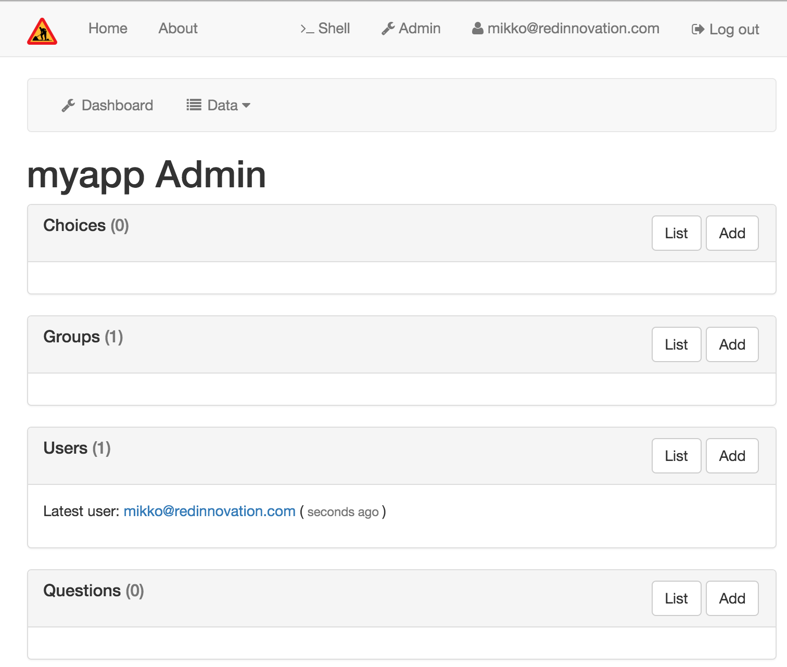

Getting started
===============

How to get your models to admin is :doc:`covered in tutorial <../../tutorials/gettingstarted/index>`.

Creating an model admin
=======================

Model admin provides automatic :term:`CRUD` for your :term:`SQLAlchemy` modelled data.

First you have created a model in ``models.py``.

Then create a model admin binding in ``admins.py`` module of your project.

.. code-block:: python

    from websauna.system.admin.modeladmin import ModelAdmin, model_admin
    from websauna.system.crud import Base64UUIDMapper

    from .models import MyModel

    @model_admin(traverse_id="my-models")
    class MyModelAdmin(ModelAdmin):
        """Example admin interface declaration for MyModel SQLAlchemy model.

        MyModelAdmin is CRUD class and traverse context for add and list operations.
        """

        title = "My Models"

        model = MyModel

        # MyModel.id attribute is UUID type.
        # This is used to generate admin URLs for the objects.
        mapper = Base64UUIDMapper(mapping_attribute="id")

        class Resource(ModelAdmin.Resource):
            """Resource wraps one MyModel instance to admin traversing hierarchy.

            It is traversing context for show, edit and delete operations.
            """

            # Get something human readable about this object to the breadcrumbs bar
            def get_title(self):
                my_model = self.get_object()  # type: MyModel
                return my_model.title  # Assume there is column MyModel.title

Make sure ``admins.py`` is scanned in your :py:class:`websauna.system.Initializer` of your application. This should happen by default with your Websauna application scaffold.

.. code-block:: python

    def configure_model_admins(self):
        """Register the models of this application."""

        # Call parent which registers user and group admins
        super(Initializer, self).configure_model_admins()

        # Scan our admins
        from . import admins
        self.config.scan(admins)

Now we can see the first peak on the model admin:

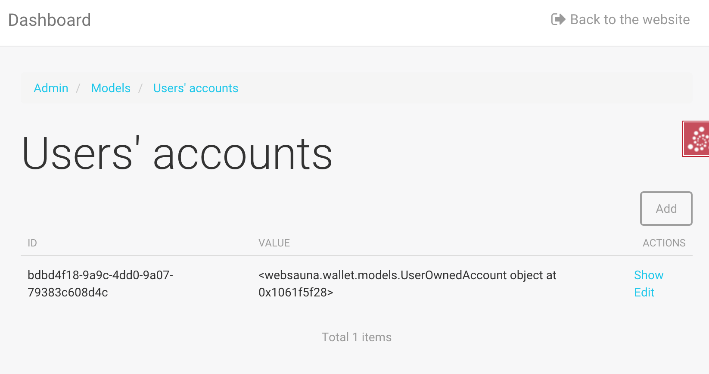

The default listing view output is still messy, because the listing view doesn't know what columns to show. Let's fix this. Let's create a new file ``adminviews.py``:

.. code-block:: python

    from websauna.system.admin.utils import get_admin_url_for_sqlalchemy_object
    from websauna.system.crud import listing
    from websauna.system.http import Request
    from websauna.system.core.viewconfig import view_overrides
    from websauna.system.admin.views import Listing as DefaultListing
    from websauna.system.admin.views import Show as DefaultShow
    from websauna.wallet.models import UserOwnedAccount
    from websauna.wallet.utils import get_asset_formatter

    from . import admins

    def get_user_for_account(view, column, user_owned_account: UserOwnedAccount):
        """Show user name."""
        return user_owned_account.user.friendly_name

    def get_asset_for_account(view, column, user_owned_account: UserOwnedAccount):
        """Show the name of the asset user is owning."""
        return user_owned_account.account.asset.name

    def get_amount_for_account(view, column, user_owned_account: UserOwnedAccount):
        """Format asset amount using a custom formatter, picked by asset type."""
        asset = user_owned_account.account.asset
        # Return a string like "{.2f}"
        formatter = get_asset_formatter(asset.asset_format)
        return formatter.format(user_owned_account.account.denormalized_balance)

    def get_user_admin_link(request: Request, resource: admins.UserAccountAdmin.Resource):
        """Get link to a user admin show view from the user owned account."""
        user_account = resource.get_object()
        user = user_account.user
        admin = resource.get_admin()
        return get_admin_url_for_sqlalchemy_object(admin, user, "show")

    @view_overrides(context=admins.UserAccountAdmin)
    class UserAccountListing(DefaultListing):
        """User listing modified to show the user hometown based on geoip of last login IP."""
        table = listing.Table(
            columns = [
                listing.Column("id", "Id",),
                listing.Column("user", "Owner", getter=get_user_for_account, navigate_url_getter=get_user_admin_link),
                listing.Column("asset", "Asset", getter=get_asset_for_account),
                listing.Column("amount", "Amount", getter=get_amount_for_account),
                listing.ControlsColumn()
            ]
        )

Now listing view looks better:

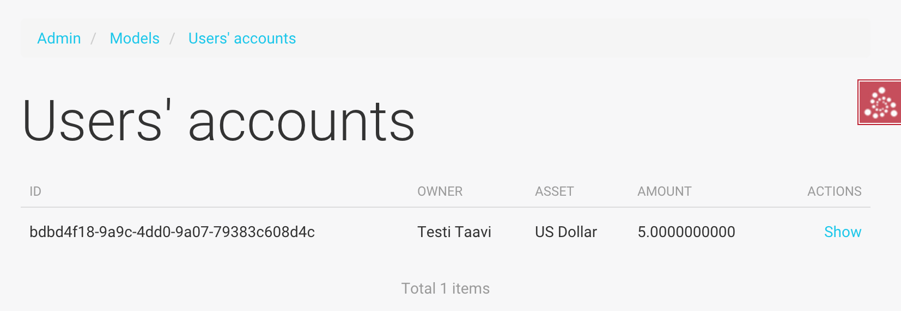

However the show view is still gibberish and does not give us any information:

Let's also fix that by adding a new class in ``adminviews.py``:

.. code-block:: python

    TODO

Customizing admin views for your model
======================================

Websauna admin comes with five default model views

* Listing

* Add

* Show

* Edit

* Delete

Websauna tries to automatically generate these fields based on SQLALchemy models. However, due to more complex user interaction and complex model definition, you usually want to hand tune the generated views to get a suitable admin interface for your business logic. Below are some examples how ot

Show view example
-----------------

Here is an example how to have a custom show page for one of our models.

``models.py``:

.. code-block:: python

    import sqlalchemy
    from sqlalchemy import Column
    from sqlalchemy.dialects.postgresql import UUID

    from websauna.system.model.meta import Base

    class Box(Base):
        """Define model for a box."""

        __tablename__ = "box"

        id = Column(UUID(as_uuid=True), primary_key=True, server_default=sqlalchemy.text("uuid_generate_v4()"))

        #: Human friendly for the box as it is now
        name = Column(String(256), nullable=False, default="")

``admins.py``:

.. code-block:: python

    from websauna.system.admin.modeladmin import ModelAdmin, model_admin
    from websauna.system.crud import Base64UUIDMapper

    from .models import Box

    @model_admin(traverse_id="boxes")
    class BoxAdmin(ModelAdmin):
        """Manage user owned accounts and their balances."""

        title = "Box"
        model = Box
        mapper = Base64UUIDMapper(mapping_attribute="id")

        class Resource(ModelAdmin.Resource):

            # Get something human readable about this object to the breadcrumbs bar
            def get_title(self):
                return self.get_object().name

``adminviews.py``:

.. code-block:: python

    import colander

    from websauna.system.admin import views as defaultadminviews
    from websauna.system.crud.formgenerator import SQLAlchemyFormGenerator
    from websauna.system.core.viewconfig import view_overrides

    from websauna.system.form.fields import UUID  # Custom widget for UUID types
    from websauna.system.form.widgets import FriendlyUUIDWidget  # Custom widget for UUID types

    from . import admins

    @view_overrides(context=admins.BoxAdmin.Resource)
    class BoxShow(defaultadminviews.Show):
        """User listing modified to show the user hometown based on geoip of last login IP."""

        # List all fields appearing on the show form
        includes = [

            # Example field where we override a widget
            colander.SchemaNode(UUID(), name='id', title="Payment module id", widget=FriendlyUUIDWidget()),

            # Example field we want to show as string id (no schema customization)
            "name",
        ]

        #: Declare form generation which maps all these fields
        form_generator = SQLAlchemyFormGenerator(includes=includes)

Then you need to also scan all the modules in the application initializer. ``__init__.py``:

.. code-block:: python

    import websauna.sstem

    class Initializer(websauna.system.Initializer):

        # ...

        def configure_model_admins(self):
            """Register admin resources and views for this application."""

              from . import admins
            from . import adminviews

            super(Initializer, self).configure_model_admins()

            # Scan our admins
            self.config.scan(admins)
            self.config.scan(adminviews)

Show view initialization for addon
++++++++++++++++++++++++++++++++++

If you are building an addon, based on :ref:`addon scaffold <scaffold>` then you need to little different scanning code. This is because add-ons rely on the parent application sending them events during the initialization. Example for addon ``__init__.py``:

.. code-block:: python

    from websauna.system import Initializer
    from websauna.utils.autoevent import after
    from websauna.utils.autoevent import bind_events

    class AddonInitializer:

        # ...

        @after(Initializer.configure_model_admins)
        def configure_model_admins(self):
            from . import admins
            self.config.scan(admins)

        @after(Initializer.configure_model_admins)
        def configure_admin(self):
            from . import adminviews
            self.config.scan(adminviews)

Add view example
----------------

Here is an example how we customize the model admin add view to include just a single field.

``models.py``:

.. code-block:: python

    class VerificationContract(Base):

        __tablename__ = "verification_contract"

        id = sa.Column(psql.UUID(as_uuid=True), primary_key=True, server_default=sa.text("uuid_generate_v4()"),)

        #: Legal name
        name = sa.Column(sa.String(256))

        #: When this was created
        created_at = sa.Column(UTCDateTime, default=now, nullable=False)

        #: When this data was updated last time
        updated_at = sa.Column(UTCDateTime, onupdate=now)

        #: Contract id as 256-bit int
        contract_address = sa.Column(sa.LargeBinary(length=20), unique=True, nullable=False)

``admins.py``:

.. code-block:: python

    from shareregistry.models import VerificationContract
    from shareregistry.utils import bin_to_eth_address
    from websauna.system.admin.modeladmin import ModelAdmin, model_admin
    from websauna.system.crud import Base64UUIDMapper

    @model_admin(traverse_id="verification-contract")
    class VerificationContractAdmin(ModelAdmin):

        title = "Verification contracts"

        singular_name = "verification contract"
        plural_name = "verification contracts"

        model = VerificationContract

        # Map objects to admin URLs via id UUID attribute
        mapper = Base64UUIDMapper(mapping_attribute="id")

        class Resource(ModelAdmin.Resource):

            def get_title(self):
                verification_contract = self.get_object()
                address = bin_to_eth_address(verification_contract.contract_address)
                return "Verification contract {}".format(address)

``adminviews.py``:

.. code-block:: python

    import colander

    from websauna.system.admin import views as adminviews
    from websauna.system.crud.formgenerator import SQLAlchemyFormGenerator
    from websauna.system.core.viewconfig import view_overrides

    from .admins import VerificationContractAdmin
    from .models import VerificationContract
    from .utils import eth_address_to_bin
    from .schemas import validate_ethereum_address

    @view_overrides(context=VerificationContractAdmin)
    class VerificationContractAdd(adminviews.Add):
        """CRUD add view for adding new verification contracts."""

        # Our limited field list on add form
        includes = [
            "name",
            colander.SchemaNode(colander.String(), name="contract_address", validator=validate_ethereum_address),
        ]
        form_generator = SQLAlchemyFormGenerator(includes=includes)

        def initialize_object(self, form, appstruct: dict, obj: VerificationContract):
            """Record values from the form on a freshly created object."""

            # Perform address translation to binary format
            appstruct["contract_address"] = eth_address_to_bin(appstruct["contract_address"])
            form.schema.objectify(appstruct, obj)

Edit view example
-----------------

Below is an example of an admin edit which has been enhanced to edit JSON field.

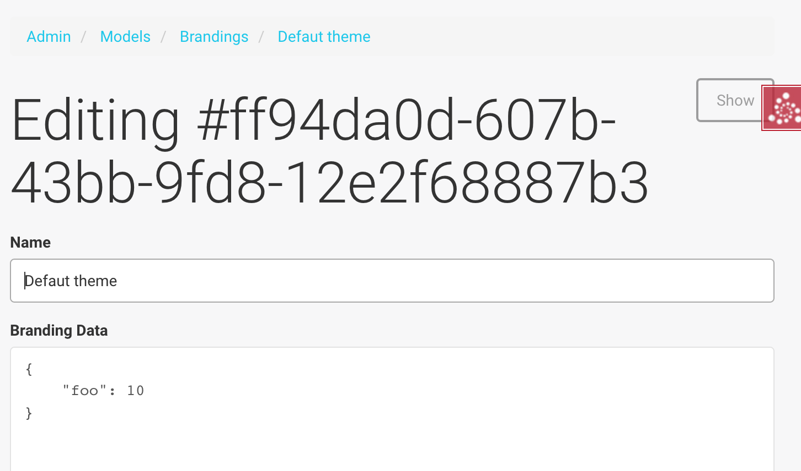

`models.py`:

.. code-block:: python

    import sqlalchemy as sa
    from sqlalchemy import orm
    import sqlalchemy.dialects.postgresql as psql

    from websauna.system.model.meta import Base
    from websauna.system.model.json import NestedMutationDict

    class Branding(Base):
        """Describe branding info of the site."""

        __tablename__ = "branding"

        #: Internal id
        id = sa.Column(psql.UUID(as_uuid=True), primary_key=True, server_default=sa.text("uuid_generate_v4()"))

        #: Human readable name of the organization. Used in footer, such.
        name = sa.Column(sa.String(256))

        #: Misc. bag of branding variables
        branding_data = sa.Column(NestedMutationDict.as_mutable(psql.JSONB), default=dict)

        def __str__(self):
            return self.name or "-"

`admins.py`:

.. code-block:: python

    from websauna.system.admin.modeladmin import ModelAdmin, model_admin
    from websauna.system.crud import Base64UUIDMapper

    from .models import Branding

    @model_admin(traverse_id="branding")
    class Branding(ModelAdmin):
        """Manage user owned accounts and their balances."""

        title = "Brandings"

        model = Branding

        # UserOwnedAccount.id attribute is uuid type
        mapper = Base64UUIDMapper(mapping_attribute="id")

        class Resource(ModelAdmin.Resource):

            def get_title(self):
                return self.get_object().name

`adminviews.py`:

.. code-block:: python

    import json
    import os

    import colander
    import deform
    import deform.widget

    def validate_json(node, value, **kwargs):
        """Make sure the user passes valid hand written JSON string."""

        try:
            json.loads(value)
        except json.JSONDecodeError:
            raise colander.Invalid(node, "Not valid JSON")

    @view_overrides(context=admins.Branding.Resource)
    class BrandEdit(adminviews.Edit):

        #: CSS styles we pass to the widget as style attribute
        PREFORMATTED = "font-family: monospace"

        includes = [
            "name",
            colander.SchemaNode(colander.String(),
                                name="branding_data",
                                validator=validate_json,
                                widget=deform.widget.TextAreaWidget(rows=10, cols=80, style=PREFORMATTED)),
        ]
        form_generator = SQLAlchemyFormGenerator(includes=includes)

        def get_appstruct(self, form: deform.Form, obj: object):
            appstruct = form.schema.dictify(obj)

            # We need to convert NestedMutationDict to a proper dictionary
            # for JSON encoder
            d = dict(obj.branding_data)

            # Convert Python dict presentation to real JSON
            # E.g. None -> null
            # Also format JSON to more human editable format
            appstruct["branding_data"] = json.dumps(d, indent=4, sort_keys=True)
            return appstruct

        def save_changes(self, form: deform.Form, appstruct: dict, obj: object):
            """Store the data from the form on the object."""

            # Perform JSON string editor translation to Python dicts
            appstruct["branding_data"] = json.loads(appstruct["branding_data"])
            form.schema.objectify(appstruct, obj)

Customizing admin views for Websauna stock models
=================================================

.. _override-listing:

Listing view example
--------------------

Here is an example how we override the existing model admin for the user. Then we enhance the admin functionality by overriding a listing view to show the city of the user based on the location of the last login IP address.

This is done using `pygeoip library <https://pypi.python.org/pypi/pygeoip/>`_.

First let's add our admin definition in ``admins.py``. Because this module is scanned after the stock :py:mod:`websauna.system.user.admins` it takes the precendence.

``admins.py``:

.. code-block:: python

    from websauna.system.admin.modeladmin import model_admin
    from websauna.system.user.admins import UserAdmin as _UserAdmin

    # Override default user admin
    @model_admin(traverse_id="user")
    class UserAdmin(_UserAdmin):

        class Resource(_UserAdmin.Resource):
            pass

Then we roll out our custom ``adminviews.py`` where we override listing view for user model admin.

``adminviews.py``:

.. code-block:: python

    import os
    import pygeoip

    from websauna.system.crud import listing
    from websauna.system.core.viewconfig import view_overrides
    from websauna.system.user import adminviews as _adminviews

    # Import local admin
    from . import admins

    _geoip = None

    def _get_geoip():
        """Lazily load geoip database to memory as it's several megabytes."""
        global _geoip
        if not _geoip:
            _geoip = pygeoip.GeoIP(os.path.join(os.path.dirname(__file__), '..', 'geoip.dat'), flags=pygeoip.MMAP_CACHE)
        return _geoip

    def get_location(view, column, user):
        """Get state from IP using pygeoip."""

        geoip = _get_geoip()

        ip = user.last_login_ip
        if not ip:
            return ""
        r = geoip.record_by_addr(ip)
        if not r:
            return ""

        code = r.get("metro_code", "")
        if code:
            return code

        code = (r.get("country_code") or "") + " " + (r.get("city") or "")
        return code

    @view_overrides(context=admins.UserAdmin)
    class UserListing(_adminviews.UserListing):
        """User listing modified to show the user hometown based on geoip of last login IP."""
        table = listing.Table(
            columns = [
                listing.Column("id", "Id",),
                listing.Column("friendly_name", "Friendly name"),
                listing.Column("location", "Location", getter=get_location),
                listing.ControlsColumn()
            ]
        )

And as a last action we scan our ``adminviews`` module in our initializer:

.. code-block:: python

    def run(self):
        super(Initializer, self).run()

        # ...

        from . import adminviews
        self.config.scan(adminviews)

This is how it looks like:

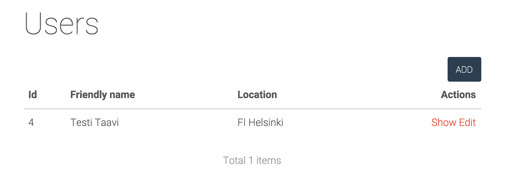

Customizing admin layout
========================

Admin has its :ref:`own separate base template <template-admin/base.html>`. You can override it for total admin customization.

Below is an example using `Light Bootstrap Dashboard <http://www.creative-tim.com/product/light-bootstrap-dashboard>`_ template by Creative Tim (non-free).

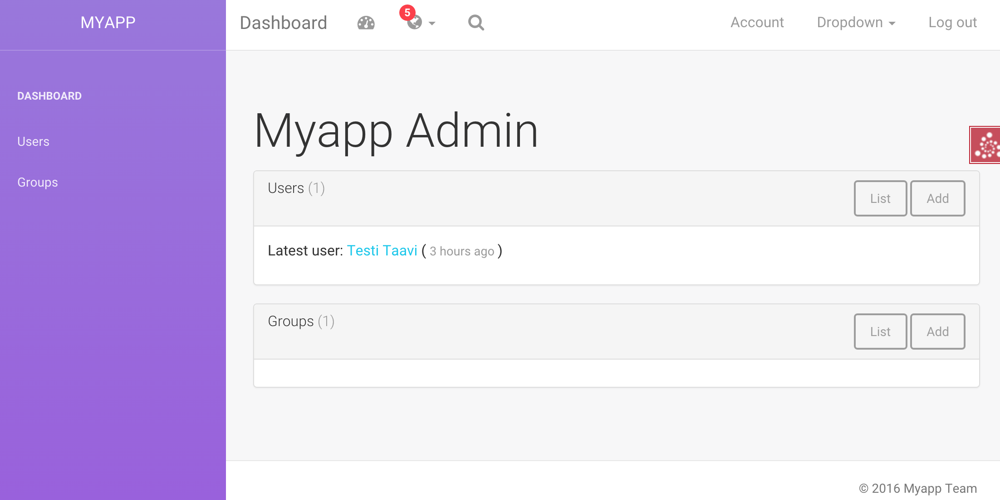

``admin/base.html``:

.. code-block:: html+jinja

    

    

      <link rel="stylesheet" href="{{ 'websauna.system:static/bootstrap.min.css'|static_url }}">
      <link rel="stylesheet" href="{{ 'wattcoin:static/admin/assets/css/light-bootstrap-dashboard.css'|static_url }}">
      <link href="http://maxcdn.bootstrapcdn.com/font-awesome/4.2.0/css/font-awesome.min.css" rel="stylesheet">
      <link href='http://fonts.googleapis.com/css?family=Roboto:400,700,300' rel='stylesheet' type='text/css'>
      <link href="assets/css/pe-icon-7-stroke.css" rel="stylesheet"/>

      {# Include CSS for widgets #}
      
        
          <link rel="stylesheet" href="{{ css_url }}"></link>
        
      

    

    
    

    
      

        

          <!--

              Tip 1: you can change the color of the sidebar using: data-color="blue | azure | green | orange | red | purple"
              Tip 2: you can also add an image using data-image tag

          -->

          

            

              <a href="{{ 'home'|route_url }}" class="simple-text">
                {{ site_name }}
              </a>
            

            
          

        

        

          <nav class="navbar navbar-default navbar-fixed">
            

              

                <button type="button" class="navbar-toggle" data-toggle="collapse" data-target="#navigation-example-2">
                  Toggle navigation
                  
                  
                  
                </button>
                <a class="navbar-brand" href="#">Dashboard</a>
              

              

                <ul class="nav navbar-nav navbar-left">
                  <li>
                    <a href="#" class="dropdown-toggle" data-toggle="dropdown">
                      <i class="fa fa-dashboard"></i>
                    </a>
                  </li>
                  <li class="dropdown">
                    <a href="#" class="dropdown-toggle" data-toggle="dropdown">
                      <i class="fa fa-globe"></i>
                      <b class="caret"></b>
                      5
                    </a>
                    <ul class="dropdown-menu">
                      <li><a href="#">Notification 1</a></li>
                      <li><a href="#">Notification 2</a></li>
                      <li><a href="#">Notification 3</a></li>
                      <li><a href="#">Notification 4</a></li>
                      <li><a href="#">Another notification</a></li>
                    </ul>
                  </li>
                  <li>
                    <a href="">
                      <i class="fa fa-search"></i>
                    </a>
                  </li>
                </ul>

                <ul class="nav navbar-nav navbar-right">
                  <li>
                    <a href="">
                      Account
                    </a>
                  </li>
                  <li class="dropdown">
                    <a href="#" class="dropdown-toggle" data-toggle="dropdown">
                      Dropdown
                      <b class="caret"></b>
                    </a>
                    <ul class="dropdown-menu">
                      <li><a href="#">Action</a></li>
                      <li><a href="#">Another action</a></li>
                      <li><a href="#">Something</a></li>
                      <li><a href="#">Another action</a></li>
                      <li><a href="#">Something</a></li>
                      <li class="divider"></li>
                      <li><a href="#">Separated link</a></li>
                    </ul>
                  </li>
                  <li>
                    <a href="#">
                      Log out
                    </a>
                  </li>
                </ul>
              

            

          </nav>

          

            

              

                {{ context|admin_breadcrumbs|safe }}

                
                

                
                

              

            

          

          <footer class="footer">
            

              

                &copy; {{ now().year }} {{ site_author }}
              

            

          </footer>

        

      

    

    

    

    
      
    

The custom sidebar pulls the contents of *Data* admin menu:

.. code-block:: html+jinja

    <ul class="nav">
      <li>
        <a href="{{ 'admin_home'|route_url }}">
          <i class="pe-7s-graph"></i>
          
Dashboard

        </a>
      </li>

      
        
          <li>
            <a href="{{ entry.get_link(request) }}">
              {{ entry.label }}
            </a>
          </li>
        
      
    </ul>

Customizing admin landing page
==============================

You can override :ref:`admin/admin.html <template-admin/admin.html>` template.

Below is an example of minor admin landing page customization:

.. code-block:: html+jinja

    

    
    

      {# Comment we changed the intro text a bit #}
      
Welcome to Your Mege Corporation dashboard, {{ request.user.friendly_name }}

    

    

      

        {# Add a custom fixed header on the top of panels #}
        

          

            <h2>Current production</h2>
            {# TODO: Add production graphs here #}
          

        

        
            {{panel|safe}}
        
      

    

    

Creating a new admin views
==========================

Below is instructions how to create your own admin views. We use a view called *phone order* as an example.

.. note::

    These instructions are for creating a view that is different type from the stock :ref:`CRUD` list, show, add, edit and delete views. If you need to customize any of existing view types please see instructions above.

Create a Pyramid traversal view and register it against Admin context. First we create a stub ``phoneorder.py``:

.. code-block:: python

    from pyramid.view import view_config

    from websauna.system.admin.admin import Admin

    @view_config(context=Admin,
        name="phone-order",
        route_name="admin",
        permission="edit",
        renderer="admin/phone_order.html")

    def phone_order(context, request):
        return {}

In your Initializer make sure the module where you view lies is scanned:

.. code-block:: python

    class Initializer:

        # ...

        def configure_admin_views(self):
            """This will pick up our view configuration from a Python module"""
            from . import phoneorder
            self.config.scan(phoneorder)

        def run(self):
            super().run()

            # ...
            # Other custom initialization here
            # ...

            # Hooks in our scanner in the application initialization
            self.configure_admin_views()

In the template ``phone_order.html``:

.. code-block:: html+jinja

    

    
    
Content goes here...

    

Then you can later get the link to this page in template code:

.. code-block:: html+jinja

    

        <a href="{{ request.resource_url(admin, 'phone-order') }}>Create phone order</a>
    

Linking into the admin views of a model
=======================================

Preface: You have an SQLAlchemy object and you want to provide the link to its admin interface: show, edit or custom action.

In view code
------------

See :py:func:`websauna.system.admin.utils.get_admin_url_for_sqlalchemy_object`.

In templates
------------

See :ref:`filter-admin_url`.

.. _admin-panel:

Creating admin panels
=====================

Websauna admin interface supports panels.

* Panel shows summary information on the landing page of the admin interface.

* Panels can be rendered inline using :ref:`render_panel() filter <filter-render_panel>`.

* Panels are registered using :py:func:`pyramid_layout.panel.panel_config` decorator that is picked up by ``config.scan()``

Panel is a ``callback(context, request, **kwargs)``

* ``context`` is any :term:`resource`, like *ModelAdmin* instance

* ``request`` is :py:class:`websauna.system.http.request.Request`

* ``kwargs`` is a dictionary of rendering hints that are passed to the rendering context as is By default contains one item ``controls`` which can be set to ``False`` to disable

Below is an example how one can customize this panel. We use ``UserOwnedAccount`` model in this example.

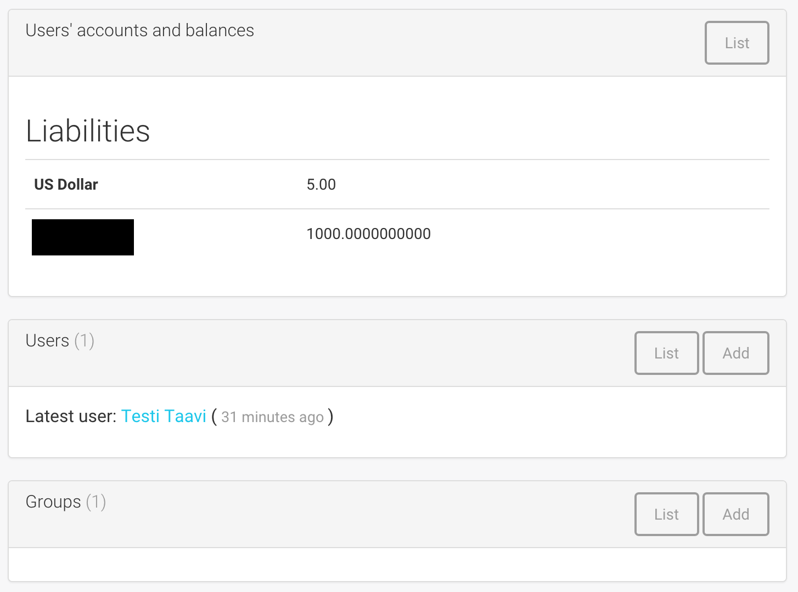

First create ``panels.py``:

.. code-block:: python

    import sqlalchemy
    from collections import OrderedDict
    from pyramid_layout.panel import panel_config
    from websauna.wallet.models import Account, UserOwnedAccount, Asset
    from websauna.wallet.utils import format_asset_amount

    from . import admins

    @panel_config(name='admin_panel', context=admins.UserAccountAdmin, renderer='admin/user_owned_account_panel.html')
    def user_owned_account(context, request, **kwargs):
        """Admin panel for Users."""

        dbsession = request.dbsession

        # Query all liabilities

        # NOTE: This is a bad SQLAlchemy example as this performances one query
        # per one asset. One could perform this with a single group by query

        liabilities = OrderedDict()
        account_summer = sqlalchemy.func.sum(Account.denormalized_balance).label("denormalized_balance")

        for asset in dbsession.query(Asset).order_by(Asset.name.asc()):
            total_balances = dbsession.query(account_summer).filter(Account.asset == asset).join(UserOwnedAccount).all()
            balance = total_balances[0][0]
            liabilities[asset.name] = format_asset_amount(balance, asset.asset_format)

        # These need to be passed to base panel template,
        # so it knows how to render buttons
        model_admin = context

        return dict(locals(), **kwargs)

Make sure you scan ``panels.py`` in your :py:class:`websauna.system.Initializer`:

.. code-block:: python

    def configure_model_admins(self):
        from . import panels
        self.config.scan(panels)

Create a matching template, ``admin/user_owned_account_panel.html`` in our case:

.. code-block:: html+jinja

    

    
    Users' accounts and balances
    

    
      <h3>Liabilities</h3>
      <table class="table">
        
          <tr>
            <th>
              {{ name }}
            </th>

            <td>
              {{ amount }}
            </td>
          </tr>
        
      </table>
    

Menu items
==========

Admin interface has menus where you can add new items.

* There is an admin navbar where you can directly include links or submenus

* You can add submenu entries like ones under models menu

Example:

.. code-block:: python

    from pyramid.events import subscriber

    from websauna.system.admin.events import AdminConstruction
    from websauna.system.admin.menu import TraverseEntry

    @subscriber(AdminConstruction)
    def contribute_model_admin(event):
        """Create newsletter menu entry in the admin interface."""

        admin = event.admin

        menu = admin.get_admin_menu()
        entry = TraverseEntry("admin-menu-newsletter", label="Newsletter", resource=admin, name="newsletter", icon="fa-envelope")
        menu.add_entry(entry)

Nested model admins
===================

Often data is naturally modelled in a :ref:`Traversal <traversal>` tree like *Organization* > *Customer* > *Invoice* where each branch may have different access level requirements. Pyramid supports traversal with permission control through :term:`ACL` and this pattern can be applied to the admin interface too. This way it is easy to give to the users fine grained access to the particular parts of an admin interface and its subobject they have a permission for.

Unlike with URL dispatch routing, with traversal path patterns are not predefined beforehand and you can easily divulge to different complex URL path layouts depending on your use case, but still enjoying simplicity and security of traversal based access control.

In this example we model organizations that have customers. User accounts can be added to groups - this is Websauna out of the box functionality through :ref:`permissions` subsystem. Organization model carries a group information telling that the users of a particular group are allowed to access the organization data. This way each group has limited access and cannot access the data of other organizations. Furthermore, due how SQLAlchemy relationships work, especially :py:class:`sqlalchemy.orm.dynamic.AppenderQuery` obtained through a parent ``ForeignKey`` relationship, this gives very natural way to refer the data in the code.

See breadcrumbs path in the following screenshot:

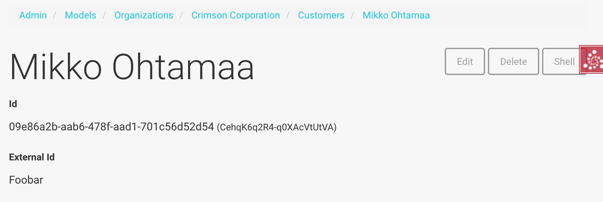

Example models
--------------

The following model code is used in this example.

``models.py``:

.. code-block:: python

    class Organization(Base):
        """A company."""

        __tablename__ = "organization"

        #: Internal id
        id = sa.Column(psql.UUID(as_uuid=True), primary_key=True, server_default=sa.text("uuid_generate_v4()"))

        #: Human readable name
        name = sa.Column(sa.String(256))

        #: Name of the group whose members are allowed to manage this organization
        manager_group = sa.Column(sa.String(256))

        def __str__(self):
            return self.name or "-"

    class Customer(Base):
        """A customer record imported from a utility company."""

        __tablename__ = "customer"

        #: Our id
        id = sa.Column(psql.UUID(as_uuid=True), primary_key=True, server_default=sa.text("uuid_generate_v4()"))

        #: ID in the customer system
        external_id = sa.Column(sa.String(64), nullable=False)

        #: Full name
        name = sa.Column(sa.String(256), nullable=False)

        #: Phone number
        phone_number = sa.Column(sa.String(256), nullable=False)

Creating nested admin CRUD resource
-----------------------------------

We create a ``ModelAdmin`` for ``Organization``. Then we create a nested ``OrganizationCustomerAdmin`` under organization path space that can be accessed through ``OrganizationAdmin.__getitem__`` traversal instead of using :py:func:`websauna.system.admin.modeladmin.model_admin` decorator that would register the model admin at the admin root.

``admins.py``:

.. code-block:: python

    from pyramid.decorator import reify
    from pyramid.security import Deny, Allow, Everyone

    from sqlalchemy.orm import Query
    from websauna.system.admin.modeladmin import ModelAdmin, model_admin
    from websauna.system.crud import Base64UUIDMapper

    from .models import Organization
    from .models import Customer

    class OrganizationCustomerAdmin(ModelAdmin):
        """Manage customer records within one organization.

        This is not registered as root level model admin, but a subadmin to existing organization ModelAdmin.

        * Organizat
        """

        title = "Customers"

        model = Customer

        mapper = Base64UUIDMapper(mapping_attribute="id")

        def __init__(self, request, organization: Organization):
            """Create the model admin and set the parent organization model of whose customers we are managing."""
            super(OrganizationCustomerAdmin, self).__init__(request)
            self.organization = organization

        def get_query(self) -> Query:
            """Use relationship and AppenderQuery from the parent organization model to get its customers.

            Relationship query automatically limits customers by customer.organization_id == organization.id
            """
            return self.organization.customers

        class Resource(ModelAdmin.Resource):

            def get_title(self):
                return self.get_object().name

    @model_admin(traverse_id="organization")
    class OrganizationAdmin(ModelAdmin):
        """Manage user owned accounts and their balances."""

        title = "Organizations"

        model = Organization

        # UserOwnedAccount.id attribute is uuid type
        mapper = Base64UUIDMapper(mapping_attribute="id")

        class Resource(ModelAdmin.Resource):

            def get_title(self):
                return self.get_object().name

            @reify
            def __acl__(self):
                """Dynamically construct ACL and allow organization management group to edit.

                Super admins inherit full priviledges from Admin root object.
                """

                organization = self.get_object()

                # Model has a group name that is allowed to manage this organzation
                group = organization.manager_group

                if group:
                    acl = [
                        (Allow, group, "view"),
                        (Allow, group, "add"),
                        (Allow, group, "edit"),
                    ]

                    return acl
                else:
                    return []

            def __getitem__(self, item):

                # Did we request a customers CRUD for this organization
                if item == "customers":
                    organization = self.get_object()
                    admin = OrganizationCustomerAdmin(self.request, organization)
                    return OrganizationCustomerAdmin.make_lineage(self, admin, "customers")

                # Standard view lookup (edit, show, etc.)
                raise KeyError

Add navigation in to the nested admin
-------------------------------------

First we add a *Customers* listing button to the organization admin:

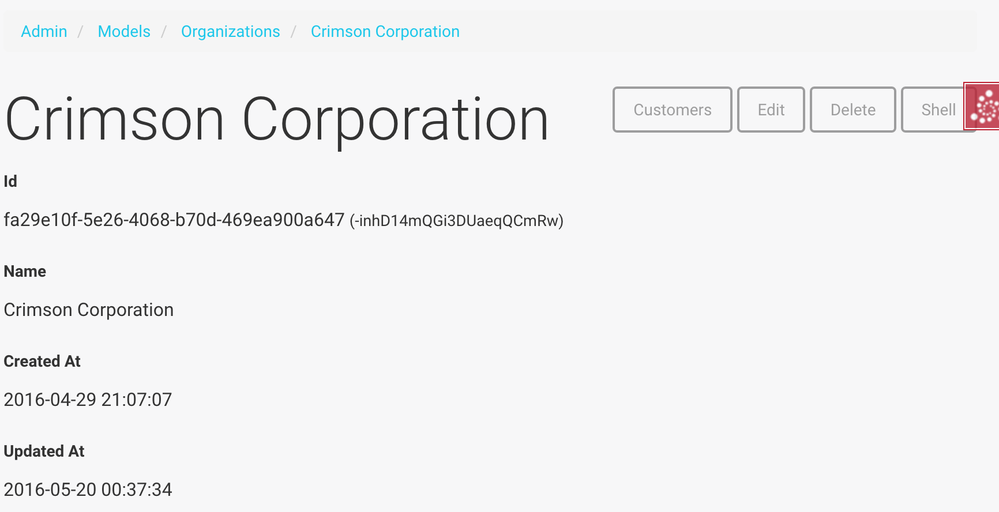

.. code-block:: python

    from websauna.system.admin import views as adminviews
    from websauna.system.crud.views import TraverseLinkButton
    from websauna.system.core.viewconfig import view_overrides

    from . import admins

    @view_overrides(context=admins.OrganizationAdmin.Resource)
    class OrganizationShow(adminviews.Show):
        """New button to get to the customer parent listing."""

        resource_buttons = [
            TraverseLinkButton(id="customers", name="Customers", view_name="customers", permission="view"),
        ] + adminviews.Show.resource_buttons

Listing view
------------

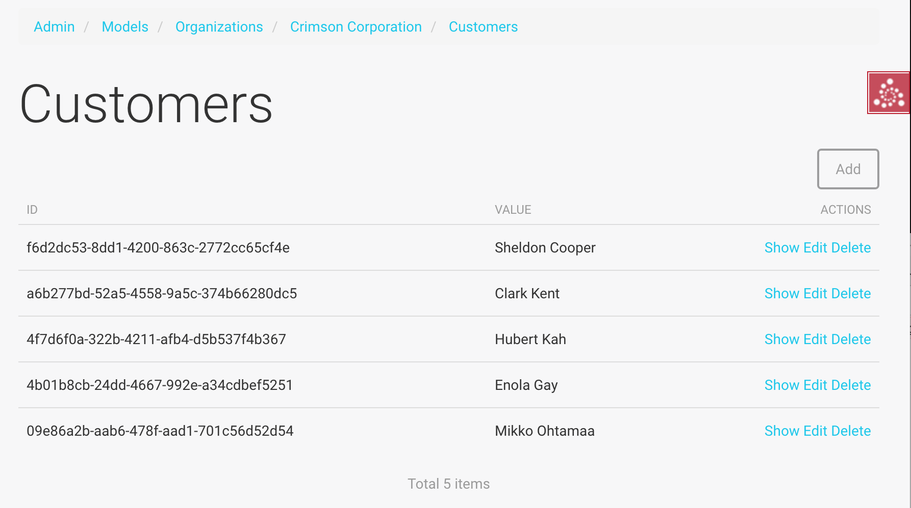

Nested admin listing view does not differ from a normal ``ModelAdmin`` listing view. ``OrganizationCustomerAdmin`` inherits the standard :py:class:`websauna.system.admin.views.Listing` view and we do not need to define this view. It uses ``OrganizationCustomerAdmin.get_query`` to populate the listing and this is limited to organization through using :term:`SQLAlchemy` ORM relationships.

Add view
--------

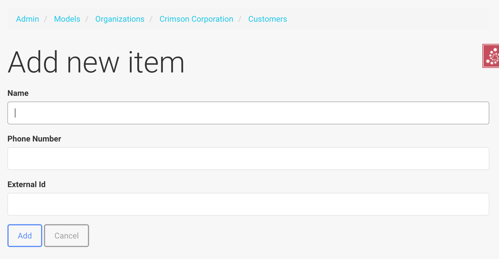

We customize ``OrganizationCustomer`` add view, so that created customers automatically become a member of a parent organization.

``adminviews.py``:

.. code-block:: python

    @view_overrides(context=admins.OrganizationCustomerAdmin)
    class OrganizationCustomerAdd(adminviews.Add):
        """Automatically set the organization parent."""

        includes = [
            "name",
            "phone_number",
            "external_id",
        ]
        form_generator = SQLAlchemyFormGenerator(includes=includes)

        def add_object(self, obj):
            """We will use the parent organization customer list where we add the object."""
            parent = self.get_crud()  # type: OrganizationCustomerAdmin
            organization = parent.organization
            organization.customers.append(obj)

            # Gives id to the added object, allows us to redirect to show it
            self.request.dbsession.flush()

Adding admin users manually
===========================

You can add new admin users through the :ref:`ws-shell`.

Example:

.. code-block:: python

    with transaction.manager:
        u = dbsession.query(User).filter_by(email="admin@example.com").one()
        g = dbsession.query(Group).filter_by(name="admin").one()
        g.users.append(u)
