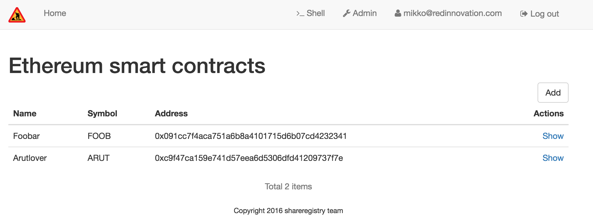
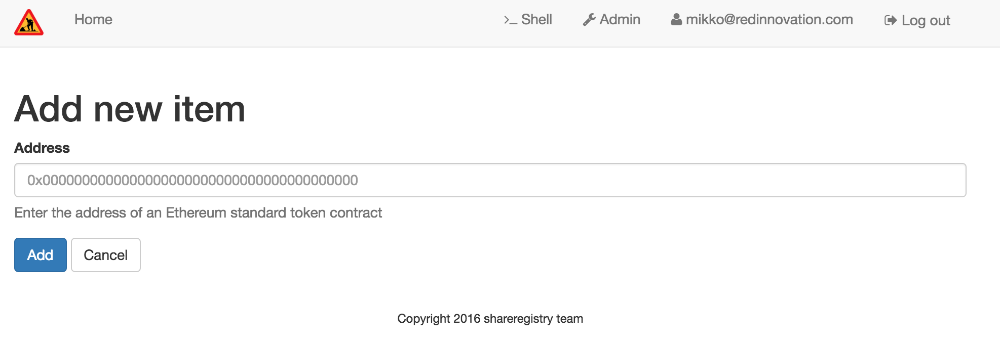
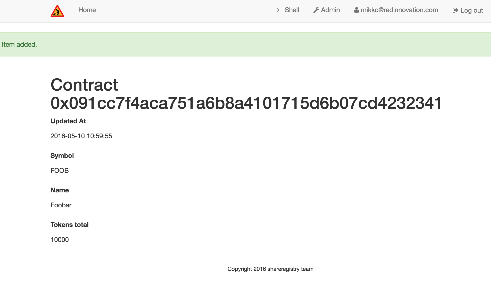
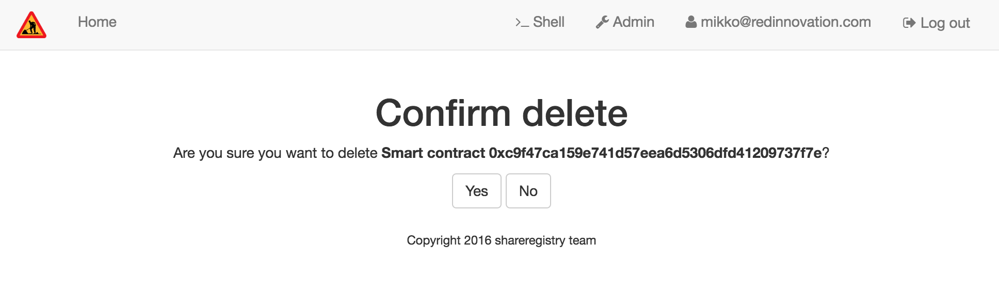

.. _CRUD:

====
CRUD
====

.. contents:: :local:

Introduction
============

Websauna comes with :term:`CRUD` (create-read-update-delete) subsystem which allows you to quickly build user interfaces to edit your data through automatically or manually generated web forms.

* CRUD comes with built-in support :term:`SQLAlchemy` models, but can be used any kind of model library or databaes

* CRUD supports :doc:`form autogeneration <../form/autoform>`, so that a CRUD UI can be generated automatically from SQLAlchemy models. You do not need to write each form by hand.

* CRUD is abstract and supports plugging in other data sources besides SQLAlchemy (see :py:class:`websauna.system.crud.CRUD` and :py:class:`websauna.system.crud.sqlalchemy.CRUD`).

* CRUD is extensively used by model :ref:`admin` interface

CRUD elements
=============

CRUD consists of basic views which are

* List all items

* Add item (C) - a form based view

* Show item (R) - a form based view

* Edit item (U) - a form based view

* Delete item (D)

CRUD controller is :term:`traversal` based and thus can be plugged in to any part of the site without a hardcoded URL configuration.

You need do

* Declare one subclass of `websauna.system.crud.CRUD` which servers the entry point into your CRUD

* This class must contain inner class of subclass of `websauna.system.crud.CRUD.Resource` which wraps raw SQLAlchemy object to traversable URLs

After this you can override any of the views by subclassing the base view and customizing it for your purposes.

For example here is an URL from the tutorial::

    http://localhost:6543/admin/models/choice/zYkpKEkpSvq02tPjL_ko8Q/show

Below is how CRUD is formed. It consists of four :term:`resource` classes (see :py:class:`websauna.system.core.traversal.Resource`) and one :term:`view`.

* ``admin`` is the default admin interface root of the site, see :py:class:`websauna.system.admin.admin.Admin`

* ``admin`` contains ``models`` path under which all CRUDs for models registered for admin are. This is presented by :py:class:`websauna.system.admin.modeladmin.ModelAdminRoot`

* ``choices`` is a CRUD root for Choices :term:`SQLAlchemy` :term:`model`. It is presented by ``myapp.admins.Choice`` which is a subclass of ``websauna.system.admin.modeladmin.ModelAdmin`` which in turn is subclass of :py:class:`websauna.system.crud.sqlalchemy.CRUD` which is the subclass of abstract CRUD implementation :py:class:`websauna.system.crud.CRUD`

* ``zYkpKEkpSvq02tPjL_ko8Q`` is the base64 encoded ::term:`UUID` (see :py:func:`websauna.system.utils.slug.uuid_to_slug`) of the ``myapp.admins.Choice`` we are currently manipulating. It resolves to ``myapp.admins.Choice.Resource`` class which is the subclass of :py:class:`websauna.system.crud.sqlachemy.Resource``. This resource wraps one SQLAlchemy object to URL traversing by giving it ``__parent__`` pointer and ``__name__`` string. URL to SQLAlchemy item mapping is done by :py:class:`websauna.system.crud.urlmapper.Base64UUIDMapper`.

* ``show`` is the :term:`view` name. Views are picked against the context they are registered. Here the context is ``myapp.admins.Choice.Resource``. It maps to :py:class:`websauna.system.admin.views.Show`, subclass of :py:class:`websauna.system.crud.views.Show`.

* View processing starts when Pyramid router calls :py:meth:`websauna.system.crud.views.Show.show`.

URL mapping
-----------

Database items are mapped to URLs and vice versa via :ref:`URL mapping <crud-url-mapping>`.

Form schema generation
----------------------

*Show*, *edit* and *add* views have a form schema which describes how individual object is shown or edited. Form schema uses :doc:`form autogeneration <../form/autoform>`, though you can manually specify the schema.

Form creation process is following for CRUDs manageing SQLAlchemy based data

* :py:meth:`websauna.system.crud.view.FormView.create_form` is called by subclasses.

* It reads :py:attr:`websauna.system.crud.view.FormView.form_generator` attribute. This attribute is unset in CRUD core xlasses. Admin classes like :py:class:`websauna.system.admin.adminviews.Show` point this to :py:class:`websauna.system.crud.formgenerator.SQLAlchemyFormGenerator`. You can also wire this to return a manually constured :py:class:`deform.Form` object directly.

* CRUD view exposes the model it manages through :py:meth:`websauna.system.crud.views.FormView.get_model` call. By default it takes the model from the current context object

* ``SQLAlchemyFormGenerator`` takes a parameter, ``includes``, which is the list of columns names or :py:class:`colander.SchemaNode` objects that go to the autogenerated form.

* :py:meth:`websauna.system.crud.formgenerator.SQLAlchemyFormGenerator.generate_form` takes in model class, :py:class:`websauna.system.form.editmode.EditMode` and passes them forward to underlying :py:class:`websauna.system.form.fieldmapper.DefaultSQLAlchemyFieldMapper`. This will run complex heurestics to determine which column generates which field and adjust widget parameters.

* ``websauna.system.crud.formgenerator.SQLAlchemyFormGenerator`` takes also a parameter ``schema_customizer`` which is a callback to edit generated form schema after its generation.

* ``websauna.system.crud.formgenerator.SQLAlchemyFormGenerator`` takes also a parameter ``schema_binder`` which is a callback to perform a `Colander schema bind <http://docs.pylonsproject.org/projects/colander/en/latest/binding.html>`_. This is how your forms can obtain information during the run-time (from database, from HTTP request). By defaul the binding is::

    schema.bind(request=request, context=context)

Example schema declaration (:py:class:`websauna.system.useradmin.adminviews.UserEdit`):

.. code-block:: python

    import colander
    from websauna.system.crud.formgenerator import SQLAlchemyFormGenerator

    class UserEdit(admin_views.Edit):
        """Edit one user in admin interface."""

        includes = [

            # Simple mapping by column name
            "enabled",

            # Use colander.SchemaNode to directly declare schema + its widget
            colander.SchemaNode(colander.String(), name='username'),

            colander.SchemaNode(colander.String(), name='full_name', missing=""),

            "email",

            # Widget creation must be deferred, because we don't know the Group class
            # and list of possible user groups until run-time
            colander.SchemaNode(GroupSet(),
                name="groups",
                widget=defer_widget_values(deform.widget.CheckboxChoiceWidget,
                    group_vocabulary,
                    css_class="groups"))
            ]

        # Create a form generator instance which will perform
        # creation of deform.Form during run-time
        form_generator = SQLAlchemyFormGenerator(includes=includes)

Permissions
-----------

CRUD uses :term:`Pyramid` :term:`ACL` to control what actions a user can perform.

* Listing and show views are controlled by permission ``view``

* Add view is controlled by permission ``add``

* Edit view is controlled by permission ``edit``

* Delete view is controlled by permission ``delete``

Below is a custom permission set up::

    from pyramid.security import Deny, Allow, Everyone

    from websauna.system.admin.modeladmin import ModelAdmin, model_admin

    from .models import UserOwnedAccount

    @model_admin(traverse_id="user-accounts")
    class UserAccountAdmin(ModelAdmin):
        """Manage user owned accounts and their balances."""

        model = UserOwnedAccount

        # Set permissions so that this information can be only shown,
        # never edited or deleted
        __acl__ = {
            (Deny, Everyone, 'add'),
            (Allow, 'group:admin', 'view'),
            (Deny, Everyone, 'edit'),
            (Deny, Everyone, 'delete'),
        }

When rendering links and buttons CRUD templates check the permissions, so that elements are hidden if the user cannot perform the target action:

.. code-block:: html+jinja

    {# Instance is subclass of websauna.system.CRUD.Resource #}
    
        <a href="{{ instance|resource_url('show') }}">
            Show
        </a>
    

Listing view
============

Listing view is provided by :py:class:`websauna.system.crud.views.Listing`. It uses ``Table`` and various ``Column`` classes in :py:mod:`websauna.system.crud.listing` to describe how the listing looks like.

* The context of a listing view is :py:class:`websauna.system.crud.CRUD`

* Stock user listing view py:class:`websauna.system.user.adminviews.UserListing`

* Listing reads the data for the list by setting up and iterating a query coming from :py:meth:`websauna.system.crud.CRUD.get_query`

Customizing columns
-------------------

Below are some examples how to customize listing columns

.. code-block:: python

    import arrow
    from decimal import Decimal

    from pyramid_layout.panel import panel_config
    from websauna.system.admin.utils import get_admin_url_for_sqlalchemy_object
    from websauna.system.crud import listing
    from websauna.system.http import Request
    from websauna.system.core.viewconfig import view_overrides
    from websauna.system.admin.views import Listing as DefaultListing
    from websauna.system.admin.views import Show as DefaultShow

    from .models import Card, BoxEventType, Box, BoxEvent
    from . import admins

    def get_serial_number(view, column, card: Card):
        return ' '.join('{:02x}'.format(x) for x in card.serial_number)

    def get_balance(view, column, card: Card):
        return card.denormalized_balance.quantize(Decimal("1.00"))

    def get_last_seen(view, column, card: Card):
        return arrow.get(card.updated_at).format("YYYY-MM-DD")

    @view_overrides(context=admins.CardAdmin)
    class CardListingListing(DefaultListing):
        """User listing modified to show the user hometown based on geoip of last login IP."""
        table = listing.Table(
            columns = [
                listing.Column("serial_number", "Serial number", getter=get_serial_number),
                listing.Column("denormalized_balance", "Balance", getter=get_balance),
                listing.Column("last_seen", "Last seen", getter=get_last_seen),
            ]
        )

    def get_location(view, column, box):
        """Get the name of the location of the box from the last install event."""

        last_install_event = box.events.filter(BoxEvent.event_type == BoxEventType.activated).order_by(BoxEvent.happened_at.desc()).first()
        if last_install_event:
            return last_install_event.event_data["owner_address"]
        else:
            return ""

    @view_overrides(context=admins.BoxAdmin)
    class CardListingListing(DefaultListing):
        """User listing modified to show the user hometown based on geoip of last login IP."""
        table = listing.Table(
            columns = [
                listing.Column("denormalized_name", "Owner"),
                listing.Column("location", "Location", getter=get_location),
                listing.Column("last_seen", "Last incoming data", getter=get_last_seen),
            ]
        )

CSV listing
-----------

There exist a handy :py:class:`websauna.system.crud.views.CSVListing` view that allows your listing to output a CSV file export instead of a HTML page.

More examples
-------------

* For an example listing view, see :ref:`overriding listing view in admin example <override-listing>`.

Add view
========

Add view is responsible for creating new items in the crud. It is a form based view and uses form autogeneration to create a new form.

* The context of a add view is :py:class:`websauna.system.crud.CRUD` or its subclasses

* For example, see :py:class:`websauna.system.user.adminviews.UserAdd`

* Availability of *Add* button in CRUD is controlled by permissions ``add``

Customizing created objects
---------------------------

Override one of multiple of

* :py:meth:`websauna.system.crud.views.Add.create_object` (construct a new object)

* :py:meth:`websauna.system.crud.views.Add.initialize_object` (populate new object with values from form)

* :py:meth:`websauna.system.crud.views.Add.add_object` (include new object in database session)

* :py:meth:`websauna.system.crud.views.Add.build_object` (all of above)

Example using :py:meth:`websauna.system.crud.views.Add.create_object`:

.. code-block:: python

    @view_overrides(context=ReferralProgramAdmin)
    class ReferralProgramAdd(adminviews.Add):
        """Admin view for editing shortened URL."""

        # We only ask for name field, everything else is filled by system
        includes = [
            "name"
        ]

        def create_object(self):
            """When created through admin, all referral programs are internal type by default."""
            model = self.get_model()
            item = model()
            item.program_type = "internal"
            return item

Example using :py:meth:`websauna.system.crud.views.Add.build_object`:

.. code-block:: python

    import colander
    import deform

    from websauna.system.crud.formgenerator import SQLAlchemyFormGenerator
    from websauna.system.admin import views as adminviews
    from websauna.system.form.sqlalchemy import UUIDForeignKeyValue
    from websauna.utils.slug import uuid_to_slug

    from .models import Customer
    from . import admins

    @colander.deferred
    def customer_selector_widget(node: colander.SchemaNode, kw: dict) -> deform.widget.Widget:
        request = kw["request"]
        dbsession = request.dbsession
        query = dbsession.query(Customer).all()
        vocab = []
        for customer in query:
            vocab.append((uuid_to_slug(customer.id), customer.name))
        return deform.widget.SelectWidget(values=vocab)

    @view_overrides(context=admins.Invoice)
    class InvoiceAdd(adminviews.Add):
        """Add invoices for customers."""

        includes = [

            # Drop down to choose customer
            colander.SchemaNode(UUIDForeignKeyValue(model=Customer, match_column="id"), name="customer", widget=customer_selector_widget, missing=None),

            # Monetary input decimal
            colander.SchemaNode(colander.Decimal(quant="1.00"), name="amount"),

            # Invoice label
            "label",

            # When invoice should be paid (datetime picker)
            "due_date_at",
        ]
        form_generator = SQLAlchemyFormGenerator(includes=includes)

        def build_object(self, form, appstruct):
            """Call invoice factory method with params we recorded from form plus additional generated parameters."""

            params = appstruct

            del params["csrf_token"]  # This is form internal parameter, no need to pass forward

            params["opened_at"] = now()
            params["external_id"] = "admin-" + str(random.randint(0, 10000))
            params["source"] = "admin"

            # This will create new Invoice object with given parameters
            # and attaches it to current dbsession
            invoice = create_invoice(**params)
            return invoice

Show view
=========

Show view shows one item. It is read only and doesn't allow user to change any values.

* The context of a add view is :py:class:`websauna.system.crud.CRUD.Resource` or its subclasses

Customizing field list
----------------------

Here is a short example how to play around with *Show* view in :ref:`admin`. It assumes the underlying :ref:`model <models>` has columns ``id``, ``denormalized_name`` and ``location``.

Example ``adminviews.py``:

.. code-block:: python

    import colander
    import deform

    from websauna.system.crud.formgenerator import SQLAlchemyFormGenerator
    from websauna.system.form.fields import UUID
    from websauna.system.form.widgets import FriendlyUUIDWidget

    # Import our admin resources
    from . import admins

    @view_overrides(context=admins.BoxAdmin.Resource)
    class BoxShow(DefaultShow):
        """Show a single box installation."""

        # List all fields appearing on the show form
        includes = [
            # Map 'id' UUID column to human title "Device id" by declaring a field and widget
            colander.SchemaNode(UUID(), name='id', title="Device id", widget=FriendlyUUIDWidget()),

            # Map 'denormalized_name' string column to human title "Owner" by declaring a field and widget
            colander.SchemaNode(colander.String(), name='denormalized_name', title="Owner", widget=deform.widget.TextInputWidget()),

            # Pass column 'location' using default field mappings
            "location"
        ]

        #: Declare form generation which maps all these fields
        form_generator = SQLAlchemyFormGenerator(includes=includes)

        def get_title(self):
            """Use denormalized_name field as the page heading."""
            return self.get_object().denormalized_name

Customizing field data
----------------------

Below is an example where the show view has fields which do not exist on the object directly:

.. code-block:: python

    import colander
    import deform

    from websauna.system.crud.formgenerator import SQLAlchemyFormGenerator
    from websauna.system.crud import views as basecrudviews

    from xxx.models import TokenContract

    @view_overrides(context=ContractCRUD.Resource,
                    route_name="user-facing-contracts",
                    permission="view")
    class ContractShow(basecrudviews.Show):
        """Show a single contract.

        """

        includes = [
            "address",
            "updated_at",
            # Retrofit fields that the form generator could not automatically figure out
            colander.SchemaNode(colander.String(), name="symbol"),
            colander.SchemaNode(colander.String(), name="name"),
            colander.SchemaNode(colander.String(), name="total_supply", title="Tokens total"),
        ]

        form_generator = SQLAlchemyFormGenerator(includes=includes)

        def get_appstruct(self, form: deform.Form, form_context: TokenContract) -> dict:
            """Get the dictionary that populates the form."""
            fields = form.schema.dictify(form_context)
            contract = form_context
            if contract.asset:
                fields["symbol"] = contract.asset.symbol
                fields["name"] = contract.asset.name
                fields["total_supply"] = contract.total_supply
            else:
                fields["symbol"] = "(pending data from network)"
                fields["name"] = "(pending data from network)"
                fields["total_supply"] = "(pending data from network)"
            return fields

        def get_title(self):
            token_contract = self.get_object()
            return "Contract " + bin_to_eth_address(token_contract.contract_address)

Here is another example:

.. code-block:: python

    import colander
    from .models import Invoice

    @colander.deferred
    def customer_selector_widget(node: colander.SchemaNode, kw: dict) -> deform.widget.Widget:
        """Create a Deform selection widget having vocabulary of all customers on the site."""
        request = kw["request"]
        dbsession = request.dbsession
        query = dbsession.query(Customer).all()
        vocab = []
        for customer in query:
            vocab.append((uuid_to_slug(customer.id), customer.name))
        return deform.widget.SelectWidget(values=vocab)

    @view_overrides(context=admins.Invoice.Resource)
    class InvoiceShow(adminviews.Show):
        """Show invoice model in admin."""

        includes = [
            "id",  # psql.UUID
            "label",  # sa.String

            # get_billable_amount() is a function on model instance
            # and thus cannot be automatically mapped,
            # so we explicitly declare this field
            colander.Schema(colander.Decimal(), name="billable_amount"),

            # ForeignKey.
            # Declare mapping explicitly to provide friendly presentation using
            # SelectWidget in read-only mode
            colander.SchemaNode(UUIDForeignKeyValue(model=Customer, match_column="id"), name="customer", widget=customer_selector_widget, missing=None),
            "created_at",  # sa.DateTime
            "updated_at", # sa.DateTime
            "external_id",  # sa.String
            "opened_at",  # sa.DateTime
            "due_date_at",  # sa.DateTime
            "invoice_data",  # psql.JSONB
            "settlement",  # sa.Enum
            "settled_at",  # sa.DateTime
            "settlement_data"  # psql.JSONB
        ]
        form_generator = SQLAlchemyFormGenerator(includes=includes)

        def get_appstruct(self, form: deform.Form, invoice: Invoice) -> dict:
            fields = form.schema.dictify(invoice)
            fields["billable_amount"] = invoice.get_billable_amount()
            return fields

Generating constant fields
--------------------------

Sometimes it is useful to generate faux fields with constant values for paper prototyping purposes. You can exploit :py:class:`colander.SchemeNode` ``default`` argument for this.

Example:

.. code-block:: python

    includes = [
        ...
        colander.SchemaNode(colander.String(), name='dummy1', title="Age", default="25"),
        colander.SchemaNode(colander.String(), name='dummy2', title="Household size", default="5"),
        ...
    ]

Edit view
=========

Edit view updates an existing item.

TODO

Delete view
===========

Delete allows to remove one existing item.

* Delete is performed either :py:attr:`websauna.system.crud.views.Delete.deleter` callback (primary if set) or :py:meth:`websauna.system.crud.CRUD.delete_object` (secondary).

* Delete can be defined as *cascading* in :term:`SQLAlchemy` model. With this model set up deleting the item will delete all related items too. See :ref:`cascade`.

Customizing templates
=====================

For minor customizations it is often enough to override the page template of a default CRUD view.

The process for this is

* Subclass the view base class. E.g. for listing view in :ref:`admin` this would be :py:class:`websauna.system.admin.views.Listing` in ``adminviews.py``.

* Declare new ``@view_config`` decorator for its view rendering method and use your CRUD resource as a ``context``. In this example we override :py:meth:`websauna.system.admin.views.Listing.listing`. Then we simply call return the :py:func:`super` call of the parent class.

* Change the ``renderer`` argument to the path of your template

* Make use ``config.scan()`` picks up the module (``adminviews.py``) in ``__init__.py``

Example ``adminviews.py``:

.. code-block:: python

    from pyramid.view import view_config
    from websauna.system.admin.views import Listing as DefaultListing

    from . import admins

    class XXXListing(DefaultListing):
        """Overrides listing view template for XXX model.""

        @view_config(context=admins.XXXAdmin, name="listing", renderer="admin/xxx_listing.html", route_name="admin", permission='view')
        def listing(self):
            return super().listing()

Here is what ``xxx_listing.html`` looks like:

.. code-block:: html+jinja

    

    

        <h1>Extra content at the top of page goes here</h1>

        {{ super() }}
    

Consult :ref:`template reference <templates>` for templates to override.

Customizing template context
----------------------------

Below is an example how to add more template context variables to a show view. Then you can then use in your template:

.. code-block:: python

    from websauna.system.core.viewconfig import view_overrides

    from shareregistry.cruds import ContractCRUD
    from shareregistry.models import TokenContract
    from shareregistry.utils import bin_to_eth_address, eth_address_to_bin

    @view_overrides(context=ContractCRUD.Resource,
                    route_name="user-facing-contracts",
                    renderer="views/contract_show.html",
                    permission="view")
    class ContractShow(basecrudviews.Show):
        """Show a single contract.

        """

        includes = [
            "address",
            "updated_at",
        ]

        form_generator = SQLAlchemyFormGenerator(includes=includes)

        def get_title(self):
            token_contract = self.get_object()
            return "Contract " + bin_to_eth_address(token_contract.contract_address)

        def show(self) -> dict:
            """Include contract token ownership listing on the show view."""

            # First populate the template context dictionary with
            # the default variables of a CRUD show view
            context = super().show()

            # Play around with our data
            token_contract = self.get_object()

            # Get a link to the contract in blockchain explorer
            token_contract_address = bin_to_eth_address(token_contract.contract_address)
            blockchain_link = self.request.registry.settings["ethereum.blockchain_contract_link"]
            blockchain_link = blockchain_link.format(token_contract_address)

            # List data about token ownerships
            token_owned_accounts = []
            for toa in token_contract.owned_accounts.order_by():
                entry = {
                    "toa": toa,
                    "address": bin_to_eth_address(toa.address),
                    "amount": toa.account.denormalized_balance
                }
                token_owned_accounts.append(entry)

            # Use a custom sorting
            token_owned_accounts = sorted(token_owned_accounts, key=lambda entry: entry["toa"].account.created_at)

            # Return retrofitted template context dictionary
            context["token_owned_accounts"] = token_owned_accounts
            context["blockchain_link"] = blockchain_link
            return context

Then a corresponding ``contract_show.html`` template:

.. code-block:: html+jinja

    

    
        <title>{{ title }}</title>
    

    

      

        

        <h1>{{title}}</h1>

        {{form|safe}}

        

          <a href="{{ blockchain_link }}">Show contract in blockchain</a>
        

        <h2>Tokens</h2>

        <table class="table">
          <thead>
            <tr>
              <th>Address</th>
              <th>Amount</th>
            </tr>
          </thead>
          
            <tr>
              <td>{{ entry.address }}</td>
              <td>{{ entry.amount|int }}</td>
            </tr>
          
        </table>
      

    

Resource buttons
================

One part of the CRUD view is resource buttons which allows jumping between different CRUD views.

TODO: Screenshot here

You can add these buttons yourself. Example:

.. code-block:: python

    from websauna.system.core.viewconfig import view_overrides
    from websauna.system.crud.views import TraverseLinkButton
    from websauna.system.user import adminviews as useradminviews

    from yourproject.admin import UserAdmin

    @view_overrides(context=admin.UserAdmin.Resource)
    class UserShow(useradminviews.UserShow):
        """View for displaying user information in admin."""

        # Add two more actions for the users
        resource_buttons = [

            # Default edit action
            TraverseLinkButton(id="edit", name="Edit", view_name="edit"),

            # New custom actions
            TraverseLinkButton(id="sms-user", name="Send SMS", view_name="sms-user"),
            TraverseLinkButton(id="license", name="Medical license", view_name="license")
        ]

More info
=========

See :py:mod:`websauna.system.user.adminviews` for CRUD used in the user and groups admin.
