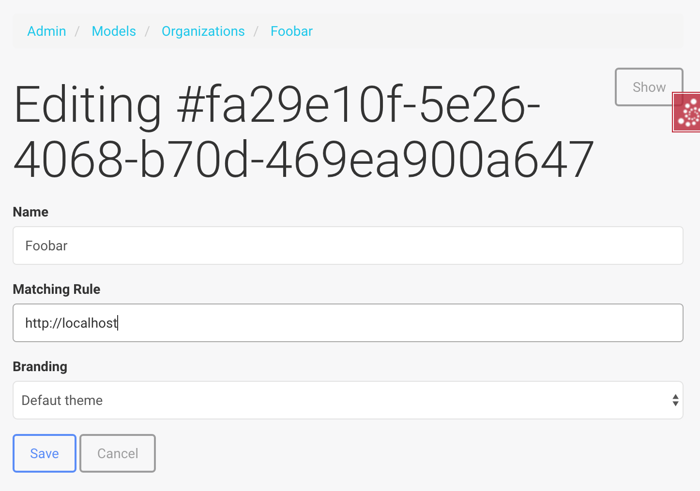

=======================
Forms based on SQL data
=======================

.. contents:: :local:

Introduction
============

The most common task of web forms is to input from and output data to a SQL database. Here are :term:`Deform` based recipes for common use cases.

Selection widget with SQL vocabulary
====================================

:py:class:`websauna.system.form.sqlalchemy.UUIDModelSel` provides a Colander schema type for matching (uuid, name) tuples to form elements and then back :term:`SQLAlchemy` objects. Furthermore a helper function :py:func:`websauna.system.form.sqlalchemy.convert_query_to_tuples` allows us to fill in a value vocabulary for select, radio or checkbox widget from a model query.

Example 1: manual form - pick multiple
--------------------------------------

Assume ``models.py``:

.. code-block:: python

    class Customer(Organization):
        """A customer belonging to one user."""

        __tablename__ = "customer"

        id = Column(UUID(as_uuid=True),
                    primary_key=True,
                    server_default=sqlalchemy.text("uuid_generate_v4()"),)

        name = Column(String(256))
        phone_number = Column(String(256))
        business_id = Column(String(256))

        user_id = Column(ForeignKey("users.id"), nullable=False)
        user = relationship(User,
                            backref=backref("own_customers",
                                            lazy="dynamic",
                                            cascade="all, delete-orphan",
                                            single_parent=True,),
                            uselist=False)

And now we want to user to select from his or her customers on a Deform form:

.. code-block:: python

    import colander
    import deform
    from websauna.system.form.schema import CSRFSchema
    from websauna.system.form.sqlalchemy import UUIDModelSet, convert_query_to_tuples
    from websauna.system.core.route import simple_route

    from .models import Customer

    def customers_by_user_widget(node: colander.SchemaNode, kw: dict):
        """Populate selection widget vocabulary with user's customers.

        :param node: The currrent :py:class:`colandar.SchemaNode` for which we are evaluation this.

        :param kw: ``schema.bind()`` arguments passed around.
        """
        request = kw["request"]
        user = request.user
        dbsession = request.dbsession
        query = dbsession.query(Customer).filter(Customer.user == user)
        vocab = convert_query_to_tuples(query, first_column="id", second_column="name")
        return deform.widget.SelectWidget(values=vocab)

    class ChooseCustomer(CSRFSchema):
        """A form with a widget to choose one of existing customers of a user."""

        customer =  colander.SchemaNode(

                # Convert selection widget UUIDs back to Customer objects
                UUIDModelSet(model=Customer, match_column="id"),

                title="Choose your customers",

                # A SelectWidget with values lazily populated
                widget=customers_by_user_widget)

    @simple_route("/choose-customer",
        route_name="choose_customer",
        renderer='nordledger/choose_customer.html')
    def choose_customer(request: Request):
        """Render an invoice creation form."""

        schema = ChooseCustomer()
        schema = schema.bind(request=request)
        form = deform.Form(schema, buttons=("submit",))
        rendered_form = form.render()

        return locals()

Example 2: admin interface - pick one
-------------------------------------

Below is an example how to create a relation picker in admin interface.

``models.py``:

.. code-block:: python

    import typing as t
    import sqlalchemy as sa
    from sqlalchemy import orm
    import sqlalchemy.dialects.postgresql as psql
    from sqlalchemy.orm import Session
    from pyramid_sms.utils import normalize_us_phone_number

    from websauna.system.model.json import NestedMutationDict
    from websauna.system.model.columns import UTCDateTime
    from websauna.system.model.meta import Base
    from websauna.utils.time import now
    from websauna.system.user.models import User

    from typing import Iterable

    class Branding(Base):
        """Describe branding info of the site."""

        __tablename__ = "branding"

        #: Internal id
        id = sa.Column(psql.UUID(as_uuid=True), primary_key=True, server_default=sa.text("uuid_generate_v4()"))

        #: Human readable name of the organization. Used in footer, such.
        name = sa.Column(sa.String(256))

        #: Misc. bag of branding variables
        branding_data = sa.Column(NestedMutationDict.as_mutable(psql.JSONB), default=dict)

        def __str__(self):
            return self.name or "-"

    class Organization(Base):
        """A utility company."""

        __tablename__ = "organization"

        #: Internal id
        id = sa.Column(psql.UUID(as_uuid=True), primary_key=True, server_default=sa.text("uuid_generate_v4()"))

        #: Human readable name
        name = sa.Column(sa.String(256))

        #: Branding for this organization
        branding_id = sa.Column(sa.ForeignKey("branding.id"), nullable=True)
        branding = orm.relationship(Branding,
                                        uselist=False,
                                        backref=orm.backref("organizations",
                                            lazy="dynamic",
                                            cascade="all, delete-orphan",
                                            single_parent=False,),)

        #: Substring startswith expression used to evaluate when we should populate app info with this organization
        #: Example: https://foobar.com
        matching_rule = sa.Column(sa.String(256))

        def __str__(self):
            return self.name or "-"

``admins.py``:

.. code-block:: python

    from pyramid.security import Deny, Allow, Everyone
    from websauna.system.admin.modeladmin import ModelAdmin, model_admin
    from websauna.system.crud import Base64UUIDMapper

    from .models import Organization
    from .models import Branding

    @model_admin(traverse_id="organization")
    class Organization(ModelAdmin):
        """Manage user owned accounts and their balances."""

        title = "Organizations"

        model = Organization

        # UserOwnedAccount.id attribute is uuid type
        mapper = Base64UUIDMapper(mapping_attribute="id")

        class Resource(ModelAdmin.Resource):

            def get_title(self):
                return self.get_object().name

    @model_admin(traverse_id="branding")
    class Branding(ModelAdmin):
        """Manage user owned accounts and their balances."""

        title = "Brandings"

        model = Branding

        # UserOwnedAccount.id attribute is uuid type
        mapper = Base64UUIDMapper(mapping_attribute="id")

        class Resource(ModelAdmin.Resource):

            def get_title(self):
                return self.get_object().name

``adminviews.py``:

.. code-block:: python

    import colander
    import deform
    import deform.widget

    from websauna.system.form.sqlalchemy import UUIDForeignKeyValue
    from websauna.system.core.viewconfig import view_overrides

    from .models import Branding

    @colander.deferred
    def branding_selector_widget(node: colander.SchemaNode, kw: dict) -> deform.widget.Widget:
        """Populate selection widget vocabulary with possible branding choice.

        :param node: The currrent :py:class:`colandar.SchemaNode` for which we are evaluation this.

        :param kw: ``schema.bind()`` arguments passed around.
        """
        request = kw["request"]
        dbsession = request.dbsession
        query = dbsession.query(Branding).all()
        vocab = [("", "[No branding]")]
        for branding in query:
            vocab.append((uuid_to_slug(branding.id), branding.name))
        return deform.widget.SelectWidget(values=vocab)

    @view_overrides(context=admins.Organization.Resource)
    class OrganizationEdit(adminviews.Edit):

        includes =  [
            "name",
            "matching_rule",
            colander.SchemaNode(UUIDForeignKeyValue(model=Branding, match_column="id"), name="branding", widget=branding_selector_widget, missing=None)
        ]
        form_generator = SQLAlchemyFormGenerator(includes=includes)

Example 3: stock group picker
-----------------------------

Websauna comes with a group vocabulary you can use to refer to groups.

``models.py``:

.. code-block:: python

    import sqlalchemy as sa
    from sqlalchemy import orm
    import sqlalchemy.dialects.postgresql as psql

    from websauna.system.user.models import Group

    class Organization(Base):
        """A company."""

        __tablename__ = "organization"

        # ...

        #: Management group of this organization
        group_id = sa.Column(sa.ForeignKey("group.id"), nullable=True)
        group = orm.relationship(Group,
                                        uselist=False,
                                        backref=orm.backref("organizations",
                                            lazy="dynamic",
                                            single_parent=False,),)

``adminviews.py``:

.. code-block:: python

    from websauna.system.user.models import Group
    from websauna.system.form.fields import defer_widget_values
    from websauna.system.form.sqlalchemy import UUIDForeignKeyValue

    from websauna.system.user.schemas import optional_group_vocabulary

    from . import admins

    @view_overrides(context=admins.OrganizationAdmin)
    class OrganizationAdd(adminviews.Add):
        """Automatically set the organization parent."""

        includes = [
            "name",

            # Pick one user group who manages this organization
            colander.SchemaNode(UUIDForeignKeyValue(model=Group, match_column="uuid"), name="group", widget=defer_widget_values(deform.widget.SelectWidget, optional_group_vocabulary, css_class="groups"), missing=None),
        ]
        form_generator = SQLAlchemyFormGenerator(includes=includes)

For more information see

* :py:meth:`websauna.system.user.schemas.optional_group_vocabulary`

* :py:meth:`websauna.system.user.schemas.group_vocabulary`

* :py:class:`websauna.system.user.schemas.GroupSet`
