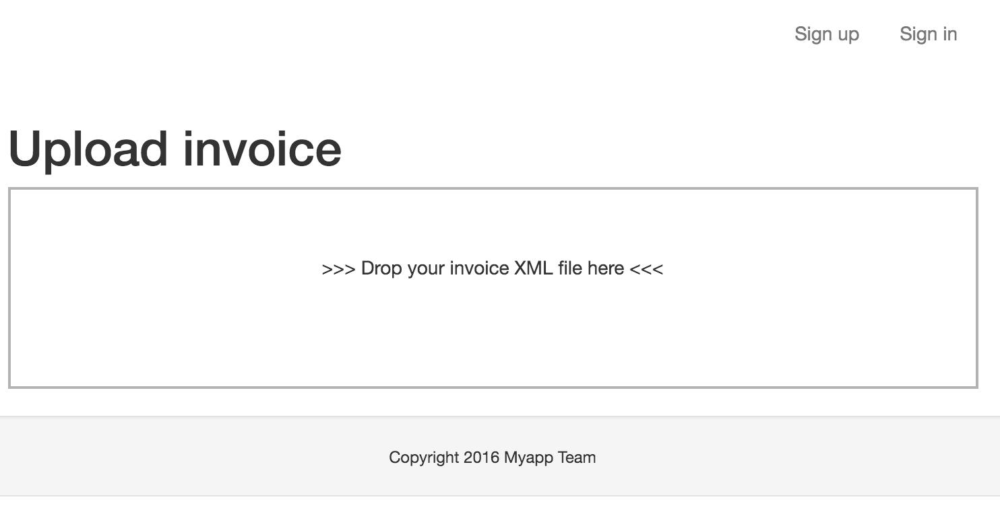

==========
JavaScript
==========

.. contents:: :local:

Introduction
============

Websauna supports integration with various JavaScript libraries.

See also :ref:`cache busting <cachebust>` how Websauna guarantees client JavaScript files are always up-to-date.

Adding JavaScript code to a specific page
=========================================

Below is an example how to integrate a JavaScript library and its integration code to one specific page. In this example we add an enhanced file upload experience using a `DropzoneJS JavaScript library <http://localhost:6543/upload-invoice>`_.

First you must add ``dropzone`` folder to :ref:`static assets <static>` of your application.

Referring JavaScript assets on a page
-------------------------------------

A custom JavaScript files are added to a `extra_body_end` block, so that they are loaded after all site default JavaScript.

A library CSS files are placed in ``extra_head`` block, so that library styles are available during the initial page rendering and there is no flicker. See :ref:`base.html template <template-site/base.html>` for more information about blocks.

Example ``upload_invoice.html``:

.. code-block:: html+jinja

    {# Use the defaut page framing #}
    

    {# Include DropzoneJS CSS on the page in <head> #}
    
      <link rel="stylesheet" href="{{ 'myapp:static/dropzone/dropzone.css'|static_url }}">
    

    {# Content block contains the body HTML #}
    
        <h1>Upload invoice</h1>
        <form id="form-upload-invoice" class="dropzone" method="POST" action="">
        </form>

    

    {# extra_body_end has everything specific to this page before closing </body> #}
    
      

      {# Include DropzoneJS JS on the page  #}
      

      {# Include our integration JS on the page  #}
      
    

Example ``dropzone-integration.js``:

.. code-block:: javascript

    /* global Dropzone, Query */

    // Disabling autoDiscover, otherwise Dropzone will try to attach twice.
    Dropzone.autoDiscover = false;

    (function($) {
      "use strict";

      // Executed when DOM parsing is done
      $(document).ready(function() {

        // Create our file dropzone through jQuery
        // http://www.dropzonejs.com/#create-dropzones-programmatically
        var dz = $("#form-upload-invoice").dropzone({
          url: window.opt.uploadTarget,
          dictDefaultMessage: ">>> Drop your invoice XML file here <<<",
          sending: function(file, xhr, formData) {
            // Include Websauna CSRF token for the form submission
            formData.append("csrf_token", window.opt.csrfToken);
          }
        });

      });

    })(jQuery);

Then you can process the upload in your ``views.py`` - this AJAX upload does not differ from a normal HTTP POST upload:

.. code-block:: python

    @simple_route("/upload-invoice",
                  route_name="upload_invoice",
                  renderer='myapp/upload_invoice.html')
    def upload_invoice(request: Request):
        """Render an invoice upload form and process uploads."""

        if request.method == "POST":
            # This is a cgi.FieldStorage instance
            file = request.POST["file"]
            # Process upload
            # ...

        return locals()

Exposing view variables to JavaScript
=====================================

Supposedly one wants to access Python data in JavaScript code. You can do this by returning Javascript objects as dictionaries from the view and then include them as JavaScript globals using `

You can also expose URLs so that JavaScript can do AJAX calls or ``window.location`` redirects::

    
    
