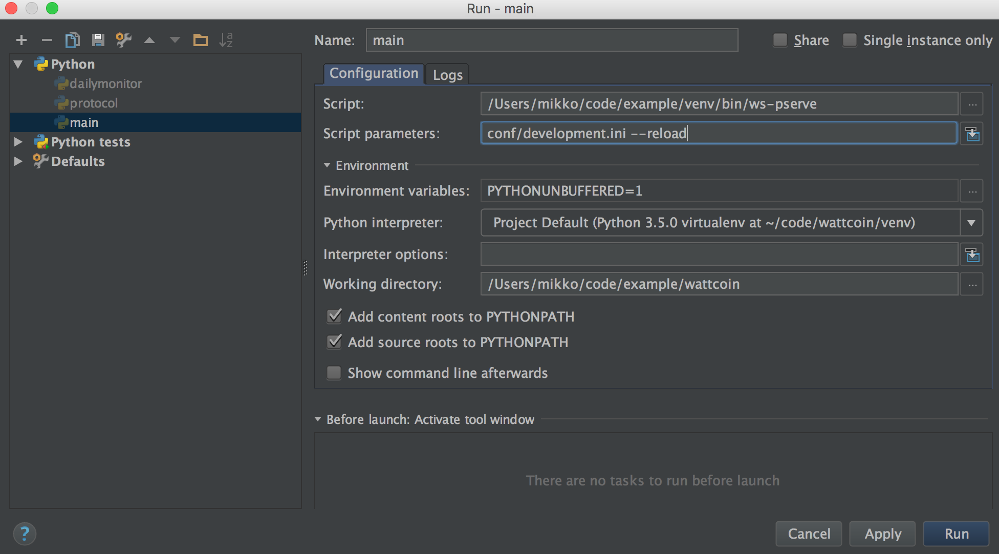

.. _devserver:

======================
Development web server
======================

.. contents:: :local:

Introduction
============

Websauna uses :term:`Waitress` based autoreloading web server for local development. See :ref:`ws-pserve` command. By default, the server binds all IPs of the computer and runs in port 6543.

Starting
========

Command line
------------

First make sure your :term:`virtual environment` is activated:

.. code-block:: console

    source venv/bin/activate

To start a local development web server in reload mode, point it to a :ref:`development.ini`:

.. code-block:: console

    ws-pserve ws://conf/development.ini --reload

Example output::

    Starting subprocess with file monitor
    Starting server in PID 75707.
    serving on http://0.0.0.0:6543

To stop the server press CTRL + C.

IDE
---

You can configure your IDE to run the development web server if you point it to a :ref:`ws-pserve` command. Below is an example for Pycharm IDE:

