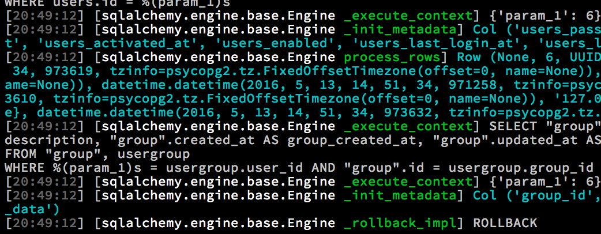

=============
Using loggers
=============

.. contents:: :local:

Introduction
============

Python standard library provides :py:mod:`logging` module as a de facto solution for libraries and applications to log their behavior. *logging* is extensively used by Websauna, :term:`Pyramid`, :term:`SQLAlchemy` and other Python packages.

* Python logging subsystem can be configured using external configuration file and the logging configuration format is `specified in Python standard libray <https://docs.python.org/3.6/library/logging.config.html#logging-config-fileformat>`_.

* Python logger can be individually turned on, off and their verbosity adjusted on per module basis. For example by default, Websauna development server sets SQLALchemy logging level to ``INFO`` instead of ``DEBUG`` to avoid flooding the console with verbose SQL logs. However if you are debugging issues related to a database you might want to set the SQLAlchemy logging back to ``INFO``.

* Logging is preferred diagnose method over print statements cluttered around source code.. Well designed logging calls can be left in the source code and later turned back on if the problems must be diagnosed further.

* Python logging output can be directed to console, file, rotating file, syslog, remote server, email, etc.

Log colorization
================

* Websauna uses `rainbow_logging_handler <https://github.com/laysakura/rainbow_logging_handler>`_ which colorizes the logs, making it easier to read them in the console of the development web server.

Standard logging pattern
========================

A common logging pattern in Python is:

.. code-block:: python

    import logging

    logger = logging.getLogger(__name__)

    def my_view(request):
        logger.debug("my_view got request: %s", request)
        logger.info("my_view got request: %s", request)
        logger.error("my_view got request: %s and BAD STUFF HAPPENS", request)

        try:
            raise RuntimeError("OH NOES")
        except Exception as e:
            # Let's log full traceback even when we ignore this exception
            # and it's not risen again
            logger.exception(e)

* This names a logger based on a module so you can switch logger on/off on module basis.

* Pass logged objects to :py:meth:`logging.Logger.debug` and co. as full and let the logger handle the string formatting. This allows intelligent display of logged objects when using non-console logging solutions like :term:`Sentry`.

* Use :py:meth:`logging.Logger.exception` to report exceptions. This will record the full traceback of the exception and not just the error message.

Please note that although this logging pattern is common, it's not a universal solution. For example if you are creating third party APIs, you might want to pass the logger to a class instance of an API, so that the API consumer can take over the logger setup and there is no inversion of control.

Changing logging level using INI settings
=========================================

Websauna defines development web server log levels in its core :ref:`development.ini`. Your Websauna application inherits settings from this file and can override them for each logger in the ``conf/development.ini`` file of your application.

For example to set :term:`SQLAlchemy` and :py:mod:`transaction` logging level to more verbose you can do:

.. code-block:: ini

    [logger_sqlalchemy]
    level = DEBUG

    [logger_transaction]
    level = DEBUG

Now console is flooded with *very* verbose logging::

    [2016-05-22 20:39:55,429] [sqlalchemy.engine.base.Engine _begin_impl] BEGIN (implicit)
    [2016-05-22 20:39:55,429] [txn.123145312813056 __init__] new transaction
    [2016-05-22 20:39:55,429] [sqlalchemy.engine.base.Engine _execute_context] SELECT users.password AS users_password, users.id AS users_id, users.uuid AS users_uuid, users.username AS users_username, users.email AS users_email, users.created_at AS users_created_at, users.updated_at AS users_updated_at, users.activated_at AS users_activated_at, users.enabled AS users_enabled, users.last_login_at AS users_last_login_at, users.last_login_ip AS users_last_login_ip, users.user_data AS users_user_data, users.last_auth_sensitive_operation_at AS users_last_auth_sensitive_operation_at, users.activation_id AS users_activation_id

Initialization loggers from INI file
====================================

If you need to initialize loggers in your own applications see :py:func:`websauna.system.devop.cmdline.setup_logging` for how Websauna picks up loggers from `INI <https://en.wikipedia.org/wiki/INI_file>`__ configuration file.

More information
================

`How Websauna logs username and email for every internal server error <https://github.com/websauna/websauna/blob/master/websauna/system/core/views/internalservererror.py>`_. It's impressive service if your devops teams calls a customer on a second an error happens and guide the customer around the error. As a bonus if using :term:`Sentry` you will see the `Gravatar profile image <http://gravatar.com>`_ of the user when viewing the exception.

`Logbook <http://pythonhosted.org/Logbook/>`_ is an alternative for Python standard library logging if performance is critical or the application has more complex logging requirements .

`Discussion about log message formatting and why we are still using old style string formatting <http://reinout.vanrees.org/weblog/2015/06/05/logging-formatting.html>`_.

`structlog package <http://structlog.readthedocs.io/en/stable/index.html>`_ - add context to your logged messages like user id or HTTP request URL.
