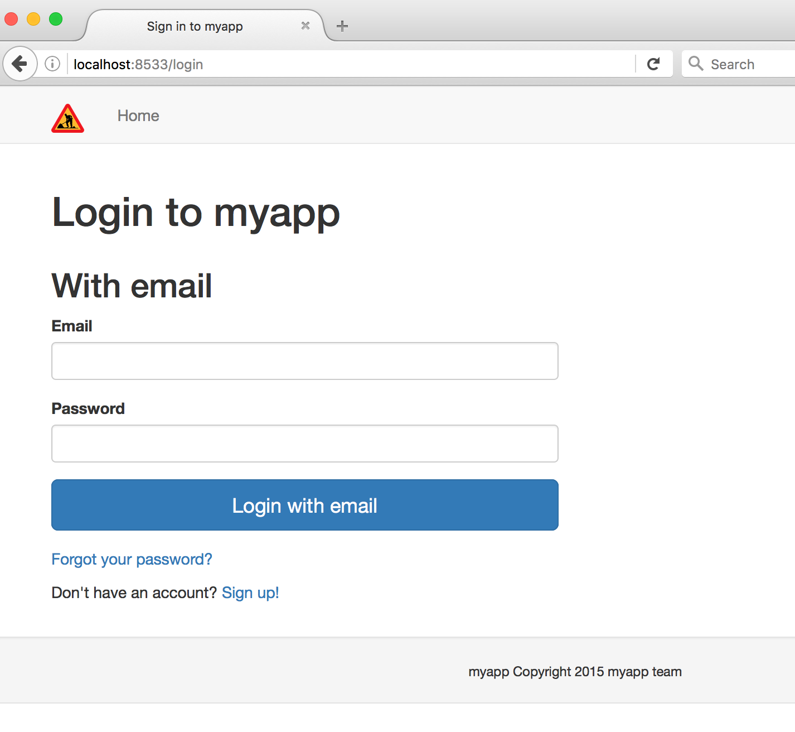
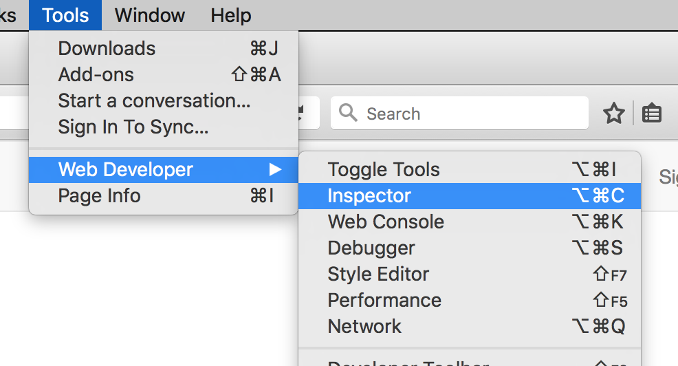
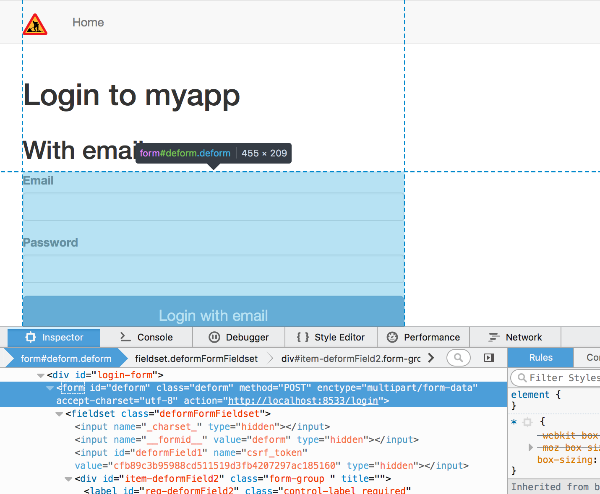

=============
Writing tests
=============

.. contents:: :local:

Testing patterns
================

Here is explained some of the test basics.

Basic integration testing pattern
---------------------------------

* py.test is launched with :ref:`test.ini` which contains settings your Websauna application uses during the testing, e.g. the name of SQL database where tests write and read data.

* You have your tests as ``myapp/tests/test_xxx.py`` files. How you split test functions to individual files is up to you.

* test function comes with the :term:`test fixtures <test fixture>` arguments needed to run the test. Usually they are

    * ``dbsession`` clean PostgreSQL where all of your model tables are automatically created. See :py:func:`websauna.tests.conftest.dbsession`.

    * ``web server`` - a string pointing to ``http://localhost:8543`` or any other address where a web server is running WSGI application with settings from ``test.ini``. See :py:func:`websauna.tests.conftest.web_server`.

    * ``browser`` - a :term:`Splinter` browser instance. It's Firefox by default. You can change it to Chrome with ``py.test --splinter-webdriver=chrome`` argument. See :py:func:`pytest_splinter.plugin.browser`.

    * ``init`` expose :py:class:`websauna.system.Initializer` instance of your Websauna application for testing. This is usually required for tests to access ``init.registry`` or ``init.config``. See :py:func:`websauna.tests.conftest.init`.

* When test is reading or writing a database with must happen inside a ``transaction.manager`` context manager.

* You can use ``assert`` statement to check that the database values are what you expect or that page elements what you expect are present. `Using plain assert statement is a py.test speciality <http://pytest.org/latest/assert.html>`_. py.test will convert assert statement to something else which gives you a diff output of diverting results.

* You need to know :term:`CSS` basics (ids and classes) to be able to identify the elements on the page being tested.

Example test which comes with the default :ref:`scaffold` (``myapp/tests/test_login.py``):

.. code-block:: python

    """An example login test case."""

    import transaction
    from pyramid.registry import Registry
    from sqlalchemy.orm.session import Session
    from splinter.driver import DriverAPI

    from websauna.tests.utils import create_user
    from websauna.tests.utils import EMAIL  # this is example@example.com
    from websauna.tests.utils import PASSWORD  # this is random letters
    from websauna.system import Initializer

    def test_login(web_server: str, browser: DriverAPI, dbsession: Session, registry: Registry):
        """Login as a user to the site.

        This is a functional test. Prepare the test by creating one user in the database. Then try to login as this user by using Splinter test browser.

        :param web_server: Functional web server py.test fixture - this string points to a started web server with test.ini configuration.

        :param browser: A Splinter web browser used to execute the tests. By default ``splinter.driver.webdriver.firefox.WebDriver``, but can be altered with py.test command line options for pytest-splinter.

        :param dbsession: Active SQLAlchemy database session for the test run.

        :param registry: Pyramid registry with all configuration settings from test.ini used to ramp up the test web server
        """

        with transaction.manager:
            # Create a dummy example@example.com user we test
            create_user(dbsession, registry, email=EMAIL, password=PASSWORD)

        # Direct Splinter browser to the website
        b = browser
        b.visit(web_server)

        # This link should be in the top navigation
        b.find_by_css("#nav-sign-in").click()

        # Link gives us the login form
        assert b.is_element_present_by_css("#login-form")

        b.fill("username", EMAIL)
        b.fill("password", PASSWORD)
        b.find_by_name("login_email").click()

        # After login we see a profile link to our profile
        assert b.is_element_present_by_css("#nav-logout")

How tests know about fixtures?
------------------------------

Fixures are just Python function argument names, so how the pytest gets to know where the fixtures are coming from?

When a test run starts, pytest scans both pytest plugins and test folders under a test. If any test folders contains a file named ``conftest.py`` pytest imports it. This file has functions with ``@pytest.fixture`` decorator to mark possible fixture test functions can use.

The default ``conftest.py`` is placed in your project by a Websauna application :term:`scaffold`. See :py:mod:`websauna.tests.conftest` for examples.

Useful Splinter functions
=========================

You'll find following :term:`Splinter` driver API functions useful when writing tests. `See Splinter documentation for full information <http://splinter.readthedocs.org/>`__.

* :py:meth:`splinter.driver.DriverAPI.visit`. - open a web page by URL

* :py:meth:`splinter.driver.DriverAPI.is_element_present_by_css`.

* :py:meth:`splinter.driver.DriverAPI.is_visible_present_by_css`. (explicitly check if we can interact with the element e.g. in the case of :term:`JavaScript` dialogs.

* :py:meth:`splinter.driver.DriverAPI.fill`. - fill in a form field

* :py:meth:`splinter.driver.DriverAPI.find_by_name`. - find a form element by its name

* :py:meth:`splinter.driver.ElementAPI.click`. - click a selected element

* :py:meth:`splinter.driver.DriverAPI.is_text_present`. - check if a text string is present on the page. Use scarcely, as this function is very slow. Prefer explicit CSS id checks if possible.

* :py:meth:`websauna.tests.utils.create_logged_in_user`. - Create a new user and make it log in to the site using a given ``browser``

Inspecting page elements during test
====================================

How do you get known to all CSS element ids, form input names and other page elements you are using in the test?

* Put a Python pdb breakpoint in a line where you want to write an assert

* Run test

* Test execution stops at the breakpoint

* Use Firefox (or Chrome) Web developer tools and Inspector tool to browse the page.

Here is a test from above with a PDB breakpoint where we want to identify how to check if a login form is present on the page:

.. code-block:: python

    def test_login(web_server: str, browser: DriverAPI, dbsession: Session, registry: Registry):

        with transaction.manager:
            # Create a dummy example@example.com user we test
            create_user(dbsession, registry)

        # Direct Splinter browser to the website
        b = browser
        b.visit(web_server)

        # This link should be in the top navigation
        b.find_by_css("#nav-sign-in").click()

        # Link gives us the login form
        import pdb ; pdb.set_trace()
        assert b.is_element_visible_by_css("???")

Now when you run the test the execution stops on debugger line::

    ==== test session starts ====
    platform darwin -- Python 3.4.2, pytest-2.8.7, py-1.4.31, pluggy-0.3.1
    rootdir: /Users/mikko/code/trees/myapp, inifile:
    plugins: splinter-1.6.7, flaky-3.0.3, cov-1.8.1, timeout-0.4
    collected 1 items

    myapp/tests/test_login.py
    >>>>>>>>>> PDB set_trace (IO-capturing turned off) >>>>>>>>>>>>>
    [44] > /Users/mikko/code/trees/myapp/myapp/tests/test_login.py(42)test_login()
    -> assert b.is_element_visible_by_css("#login-form")
    (Pdb++)

The test browser (Firefox) should have opened when the test run starts. Now switch to Firefox and you should see the page being tested.

Choose *Tools* -> *Web Developer* -> *Inspector* (This is also available from Firefox right click menu):

Now you can use Inspect tool to examine the page :term:`DOM` tree and find the id of ``<form>`` element:

Pick the id from the inspector and use it with :py:meth:`splinter.driver.DriverAPI.is_element_present_by_css`.

Functional testing and SQLAlchemy detached object state
=======================================================

When working with functional tests, one has to do real commits for data changes, as otherwise the data cannot be exported across the threads: the thread running unit test functions and another thread being the web server and serving HTTP responses.

This may be pain, as soon as you commit you cannot access SQLAlchemy object attributes anymore, making writing the test code requiring extra boilerplate and loads to avoid all ``sqlalchemy.orm.exc.DetachedInstanceError`` exceptions.

This can be avoided by telling SQLAlchemy explicitly to not to detach objects after commit, allowing you to read objects fine in the test methods.

Example ``conftest.py``:

.. code-block:: python

    import pytest

    @pytest.fixture
    def functional_dbsession(request, dbsession):
        """Use this as the last fixture for the functional test functions.

        Commits everything set up in prior fixtures so that they are available cross threads to the web server.
        """
        dbsession.expire_on_commit = False
        dbsession.transaction_manager.commit()

    @pytest.fixture
    def box(request, dbsession):
        b = Box.create(dbsession, box_type=BoxType.testing, serial_number=1)
        return b

Example ``test_api.py``:

.. code-block:: python

    import binascii
    import requests

    def test_provision_card(web_server, box, card, functional_dbsession):

        # functional_dbsession as the last argument causes a database commit,
        # but we can still access the model attributes of box and card fine

        data = {
            "box_serial_number": box.hash_id,
            "card_serial_number": binascii.hexlify(card.serial_number),
        }

        response = requests.post(f"{web_server}/api/provision", params=data)

        assert response.status_code == 200, "Got: {}".format(response.text)

        response = response.json()
        assert response["status"] == "ok"
        assert response["ownership_info"]["owner_name"] == "Mikko Ohtamaa"
        assert response["ownership_info"]["owner_phone_number"] == "+18082303437"
