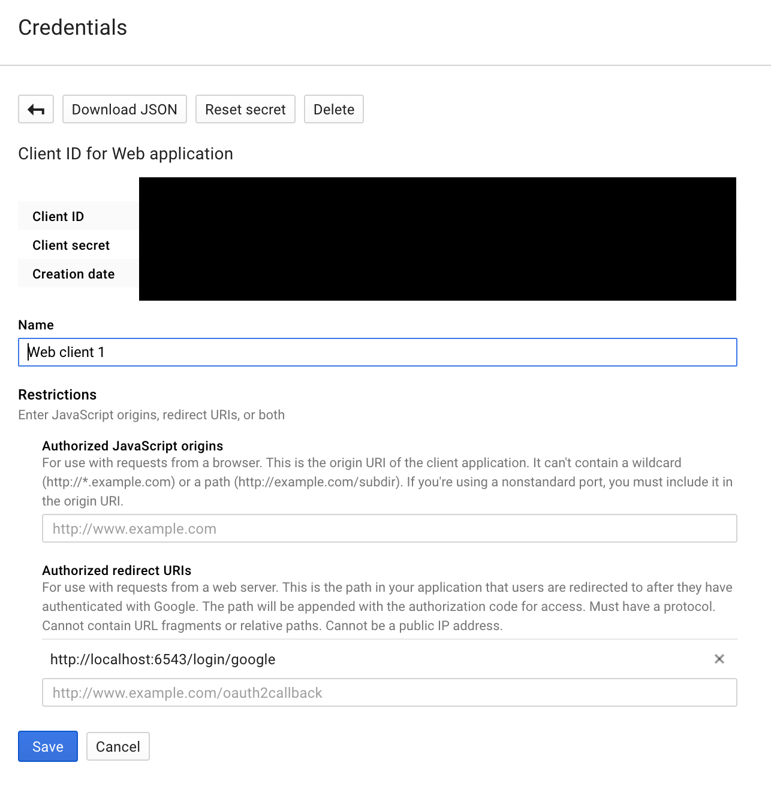
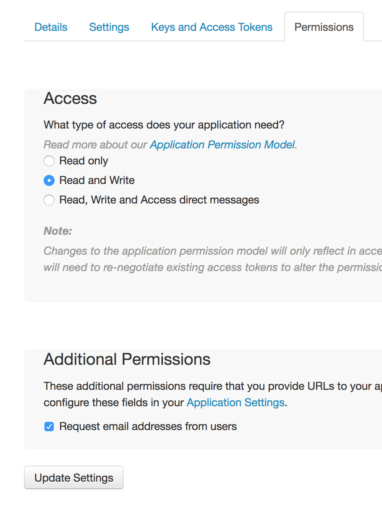

================================
Federated authentication (Oauth)
================================

.. contents:: :local:

Introduction
============

Internally Websauna uses :py:term:`Authomatic` framework to implement :term:`OAuth`.

See Getting started tutorial how to set up Facebook authentication. Same mechanism applies to every OAuth provider like Google, Twitter and GitHub.

Enhanced login experience
=========================

See `websauna.magiclogin addon <http://github.com/websauna/websauna.magiclogin>`_ for the best login experience.

Setting up Facebook login
=========================

See :ref:`tutorial-facebook-login`.

.. _google-auth:

Setting up Google login
=======================

Sign in to `Google API console <https://console.developers.google.com/apis>`__.

Create *New Project* (top left menu).

Go to *Credentials*.

Create credentials for *OAuth client ID*.

Configure OAuth Consent Screen (your product logos), such.

Create *Web application*.

Set *Authorized redirect URIs*.

In :ref:`development.ini` enable Google login:

.. code-block:: ini

    websauna.social_logins =
        google

In :ref:`development-secrets.ini <development.ini>` add Google OAuth details:

.. code-block:: ini

    [google]
    class = websauna.system.user.googleoauth.Google
    consumer_key = xxxx.apps.googleusercontent.com
    consumer_secret = xxxx
    mapper = websauna.system.user.social.GoogleMapper
    scope = profile email

More information

* https://developers.google.com/identity/protocols/OpenIDConnect

* https://github.com/peterhudec/authomatic/issues/153

.. _twitter-auth:

Setting up Twitter login
========================

First create an app in `apps.twitter.com <https://apps.twitter.com>`_.

You need to configure privacy policy and terms of service for your application. Then set your app permissions to ask for an email address permission with *Read only* access:

In :ref:`development.ini` enable Twitter login:

.. code-block:: ini

    websauna.social_logins =
        twitter

In :ref:`development-secrets.ini <development.ini>` add Twitter OAuth details:

.. code-block:: ini

    [twitter]
    class = authomatic.providers.oauth1.Twitter
    consumer_key = x
    consumer_secret = y
    scope =
    mapper = websauna.system.user.social.TwitterMapper

Customizing OAuth login
=======================

The default OAuth login logic is implemented in :py:class:`websauna.system.user.oauthloginservice.DefaultOAuthLoginService`. It directly wraps underlying :py:term:`Authomatic` request processing.

You can drop in your own replacement for OAuth authentication by overriding :py:meth:`websauna.system.Initializer.configure_federated_login`.

Mapping external users to Websauna users
========================================

By default, Websauna uses the email field of OAuth provider to map the external user to Websauna users. It's convenient as if the user has the same email account in Facebook and Twitter the user can use both service to sign in to Websauna and they get into the user account. Furthermore if the user does a Forget password action they will get a traditional email and password login.

In some cases mapping users by email is not desirable. For example, you don't trust the identity providers to do a good job with email confirmations. In this case you case customize the behavior by rolling out your own federated authentication account mapper.

See :py:class:`websauna.system.social.SocialLoginMapper` for more details.

Custom login form
=================

Below is an example ``home.html`` which contains only a site logo and Facebook log in button:

.. code-block:: html+jinja

    

    

      

        

          

          <form method="post" action="{{ 'login'|route_url('facebook') }}">

            <input name="csrf_token" type="hidden" value="{{ request.session.get_csrf_token() }}">

            <button id="btn-login-facebook" class="btn btn-primary btn-lg btn-login-facebook">
                <i class="fa fa-facebook"></i>
                Login with Facebook
            </button>
          </form>
        

      

    

Automated OAuth login tests
===========================

Your test suite might want to confirm OAuth login keeps working. This needs some special set up. Below is how one can deal with Facebook.

* Facebook allows only one "Website" platform per application, so you need to create a separate Facebook app test versions for development (``http://localhost:6543``) and test runner (``http://localhost:6662``)

* :py:func:`websauna.tests.webserver.customized_web_server` comes with a a helper function to roll out your own pytest fixture that opens a test web server in in a fixed port ``6662`` for Facebook testing

* Email and password for Facebook testing can be configured using environment variables for safety. It is recommended to sign up a dummy Facebook user for automated test runs. Remember to confirm the phone number of the user or *developer.facebook.com* does not behave correctly.

* Invite test Facebook users to your Facebook application test group, as test applications are not public

Here is an example test case:

.. code-block:: html+jinja
    
    from decimal import Decimal
    
    import pytest
    import transaction
    
    from sqlalchemy.orm.session import Session
    from splinter.driver import DriverAPI
    from myapp.models import get_or_create_default_asset
    from websauna.system.user.models import User
    from websauna.tests.test_facebook import do_facebook_login
    from websauna.wallet.models import UserOwnedAccount
    
    from websauna.tests.webserver import customized_web_server
    
    
    @pytest.fixture(scope="module")
    def fb_web_server(request, app):
        """Run a web server for Facebook login with fixed http://localhost:6662 address."""
    
        web_server = customized_web_server(request, app, customized_port=6662)
        return web_server()
    
    
    def test_new_social_account_sign_up_bonues(fb_web_server:str, browser:DriverAPI, dbsession:Session):
        """All new users through Facebook should be given a bonus on sign up."""
    
        # Direct Splinter browser to the website
        b = browser
        b.visit(fb_web_server)
    
        b.find_by_css("#btn-login-facebook").click()
    
        do_facebook_login(browser)
    
        with transaction.manager:
            u = dbsession.query(User).first()
            asset, _ = get_or_create_default_asset(dbsession)
            ua, _ = UserOwnedAccount.get_or_create_user_default_account(u, asset)
            assert ua.account.denormalized_balance == Decimal(5.00)

