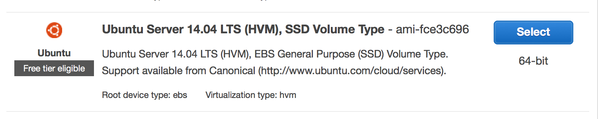
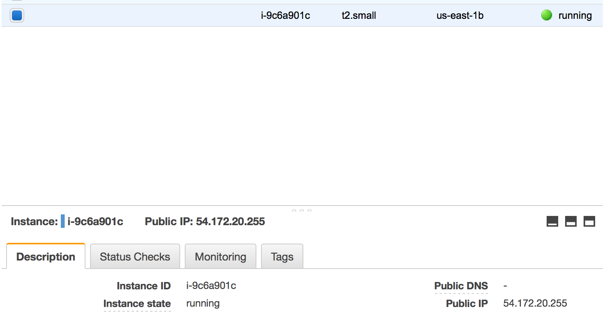

.. _ec2:

=======================
Deploying on Amazon EC2
=======================

These are Amazon specific instructions to deploy Websauna with :term:`Ansible`.

Getting a EC2 machine
=====================

Sign up to Amazon AWS with your credit card.

Go to EC2 dashboard. Choose launch instance.

.. image:: images/amazon1.png
    :width: 640px

For the image choose *Ubuntu 14.04*.

For real production usage choose at least *t2.small*. You can also run on *t2.micro*, but do not expect stellar performance.

On the instance review page, edit security groups and make sure you enable

* HTTP

* HTTPS

* ICMP - all ports (includes ping, others)

.. image:: images/amazon3.png
    :width: 640px

Create a new SSH keypair with Amazon (unless you have an existing one).

.. image:: images/amazon4.png
    :width: 640px

Place the downloaded ``websauna.pem`` to ``~/.ssh`` folder on your UNIX computer. Make sure it has correct UNIX file permissions:

.. code-block:: console

    chmod u+rx,g-rwx,o-rwx ~/.ssh/websauna.pem

Let the instance launch. After the instance is running you should see the public IP in the EC2 instance listing under Running Instances.

Try SSH into the box:

.. code-block:: console

    ssh -i ~/.ssh/websauna.pem ubuntu@54.172.20.255

You should see Ubuntu prompt.

Preparing a playbook
====================

Make sure your application is in a Git repository.

Make sure you have run ``pip freeze`` for the application.

Clone ``websauna.ansible`` project from Github.

Prepare virtual environment and install packages as instructed.

Make sure you have prepared ``htpasswd`` password if you are deploying a staging site.

Make sure you have a domain name configured to point EC2 instance public IP (``server_name`` below).

Prepare a Mandrill account and its credentials in vault for outgoing email.

If you have API keys like Facebook OAuth tokens, make sure you have them in a ``production-secrets.ini`` on your local hard disk.

Create a playbook file ``playbook-amazon.yml``:

.. code-block:: yaml

    - hosts: all
      become: yes
      become_user: root
      gather_facts: true

      # These need to be set up before reading default.yml - more variables are generated based on these
      vars:
        - package_name: myapp
        - server_name mysite.example.com
        - site_id: myapp_staging
        - mandrill: on
        - ssl: off
        - cloudflare: off
        - new_relic: off
        - notify_email: mikko@example.com
        - git_repository: git@bitbucket.org:miohtama/myapp.git
        - site_mode: staging

      pre_tasks:

        # Load default vars based on playbook.yml input
        - include_vars: default.yml

        # Load variables from the vault
        - include_vars: secrets.yml

      roles:
      - websauna.preflight
      - websauna.users
      - websauna.ssh
      - websauna.harden
      - websauna.postfix
      - websauna.mandrill
      - ANXS.postgresql
      - Stouts.nginx
      - Stouts.redis
      - Stouts.python
      - { role: websauna.site, tags: [ 'site-update'] }
      - websauna.postflight

Then prepare a ``hosts.ini`` file::

    [default]
    production ansible_host=1.2.3.4 ansible_user=ubuntu www_ip=5.6.7.8 ansible_ssh_private_key_file=~/.ssh/websauna.pem

Some notes

* ``ansible_ssh_host`` is the public IP of the instance - the one you used to SSH in earlier

* ``www_ip`` is actually *Private IP* as shown in EC2 instance description earlier. This is the IP address HTTP/HTTPS ports will be bound to. (TODO: Not sure why you need to bind HTTP/HTTPS against this IP).

Add Amazon SSH key to our SSH agent. Also include Bitbucket, Github and relevant keys you need for cloning out git repositories::

    ssh-add ~/.ssh/websauna.pem

Then it's play time::

    ansible-playbook -i hosts.ini amazon.yml

Checking the site
=================

If the playbook completes successfully, which it does if you have followed the instructions, you can check your site. You need to do this using ``server_name``. E.g.::

    http://mysite.example.com

This should bring up the home page:

Setting up backup
=================

The default
