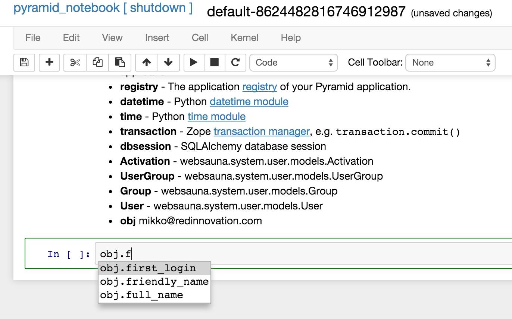

======================
Enter IPython Notebook
======================

Websauna offers an integrated :doc:`IPython Notebook shell <../../narrative/misc/notebook>` on the site. It is the most powerful built-in tool for diagnostics, data analysis and poking your database.

Here we show how to enter to the IPython Notebook and create additional user through Python shell.

The notebook shell will be extensively used in the following chapter of this tutorial.

Enter notebook
--------------

You can enter the notebook in two ways

* The *Shell* link in the top navigation bar opens a generic notebook session

* The *Shell* button of an :ref:`admin` interface object opens a notebook session prepopulated with this particular item

.. note ::

    Firing up the shell takes some seconds as IPython Notebook is rather heavyish.

.. image:: images/enter_notebook.png
    :width: 640px

Using shell
-----------

Let's change the name of your user through the notebook.

* Navigate to your user object in admin interface *Admin > Models > Users > [your user]*

* Press *Shell* button next to *Edit* button and *Set password* Buttons. **Note**: This is different Shell button from one at the top navigation.

Now Notebook exposes the currently browser item as ``obj`` variable.

Type in shell (you can use TAB key for autocomplete variable names and functions)::

    obj.full_name = "The king of Python"
    transaction.commit()

Press ALT + Enter to execute the current contents of the cell in notebook. There is no output for a successful command, because the last line in the cell (``transaction.commit``) returns ``None``.

The latter line is important, because unlike when processing HTTP requests, in shell transactions are not automatically committed. For more information this you can read :doc:`database documentation chapter <../../../narrative/modelling/database>`.

.. image:: images/notebook_changes.png
    :width: 640px

Exit notebook
-------------

You can shut down the notebook by pressing *[ shutdown ]* link in the top. Now navigate back to your user in admin. You see its name has been updated.

.. image:: images/updated_user.png
    :width: 640px

