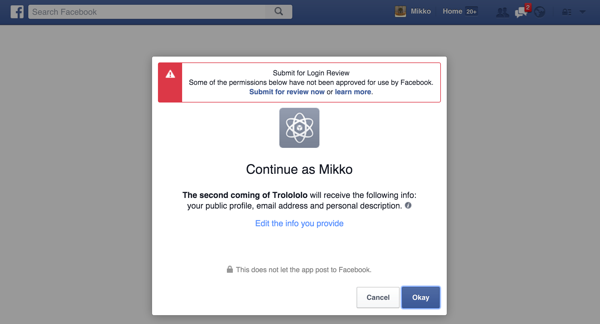

.. _tutorial-facebook-login:

=========================================
Federated authentication (Facebook login)
=========================================

Websauna supports federated authentication (term:`OAuth`), more commonly known as a social login. You can use the login service of well known identity providers like Facebook, Twitter or Google to sign in to a Websauna site.

* This encourages people to sign up for your service as they do not need to fill cumbersome sign up forms.

* Users cannot be enforced to use secure passwords and safe password handling habits. Using a well established identity provider decreases the risk the site user gets their account compromised in cases like password keylogging. Well established identity providers have heuristics systems to detect account fraud and quickly alert users if there is a reason to believe their credentials have leader.

Obtaining Facebook login API keys
=================================

To use OAuth authentication you need to obtain OAuth consumer and API keys from the authentication provider. The API keys is application specific and are not to share. First you need to have a Facebook account which you can use to sign in to their developer services.

Go to `developer.facebook.com <http://developer.facebook.com/>`_.

Choose *Add a New App* in the profile menu.

Now we can the answer we all have been waiting for:

.. image:: images/facebook_add_app.png
    :width: 640px

Then choose *Website*.

Give the name of your app e.g. *myapp*.

.. image:: images/facebook_app_name.png
    :width: 640px

For *Category* you can see *Apps for Pages*.

Press *Skip quickstart* as Facebook app developer welcome wizard will only make you confused.

.. image:: images/facebook_skip_quickstart.png
    :width: 640px

In *Settings* choose *Add Platform*. Use the development server localhost URL for the site ``http://localhost:6543``.

.. image:: images/facebook_site_url.png
    :width: 640px

*Save changes*.

Now you can get your OAuth API keys. On the settings page. Press *App secret* -> *Show*.

* **App ID** is the OAuth **consumer key**.

* **App Secret** is the OAuth **consumer secret**.

Open ``company/application/conf/development-secrets.ini``. Fill in information in ``[facebook]`` section::

    [facebook]
    class = authomatic.providers.oauth2.Facebook
    consumer_key = <consumer key goes here>
    consumer_secret = <consumer secret goes here>
    scope = user_about_me, email
    mapper = websauna.system.user.social.FacebookMapper

Now edit ``company/application/conf/development.ini``. Under ``[app:main]`` add a new setting::

    websauna.social_logins =
        facebook

Logging in with Facebook
========================

Spin up your development web server. Make sure you are signed out. Go to *Sign in* page. Now you can log in with Facebook.

.. image:: images/login_with_facebook.png
    :width: 640px

Press *Login with Facebook* and a warning appears:

This is because you have not filled in all the settings in *developer.facebook.com* and your Facebook application is not set to be public at the moment. The login will work for your own Facebook account, though.

If your Facebook account uses the same email as you gave earlier for ``ws-create-user`` command you can now use Login with Facebook to log in as administrator. Otherwise a new user is created. The new user does not have access to the admin, as this is given to the site initial user only. However you can use the initial user to edit the newly created user and add it to *Admin* group.

.. image:: images/edit_user_groups.png
    :width: 640px

More information
================

Read :doc:`Websauna OAuth documentation <../../../narrative/user/oauth>`.

